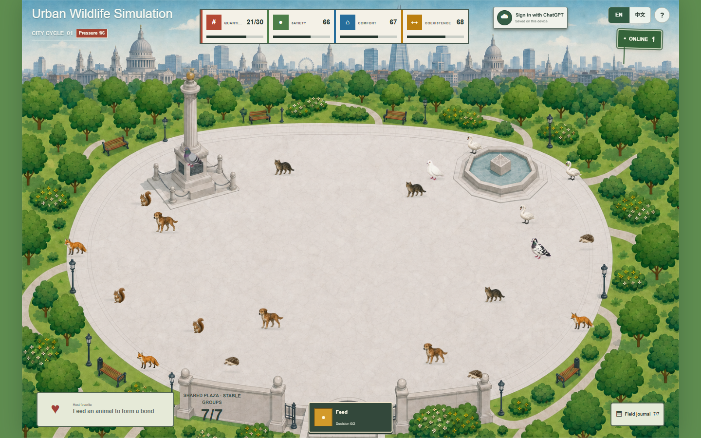

# Urban Wildlife Simulation

**Repository role: preliminary web demo and design-process evidence.**

This repository does not contain the Unity version. The web demo and Unity
prototype are separate implementations and must be documented with separate
source files, screenshots, builds, testing records, and development histories.

[Launch the public web demo](https://urban-pigeon-simulation.lkt1009.chatgpt.site/)



*Figure 1. Current preliminary web demo at the start of a city cycle. This is a
browser-runtime screenshot, not evidence of the Unity implementation.*

## Project versions

| Version | Purpose | Technology | Repository status |
| --- | --- | --- | --- |
| Preliminary web demo | Rapid interaction, visual, and systems prototyping | React, TypeScript, CSS, Vinext/Vite | Included here |
| Unity prototype | Final physical-interaction artefact and assessed implementation | Unity and C# | Separate project; link not yet supplied |

The final assessment journal should be published with the Unity repository and
link back to this repository in its development-process section. This web
repository should not be renamed or presented as the Unity submission.

## Research focus

**Research question:** How can interactive simulation make the otherwise
invisible ways in which humans shape the living conditions of urban wildlife
perceptible?

The project explores feeding as both care and intervention. Immediate benefits
are made visible alongside delayed changes in reliance, gathering pressure,
population balance, and coexistence. The simulation is deliberately
time-compressed and speculative. It is not an ecological forecast or guidance
about feeding wildlife.

## Current web demo

- Seven urban animal species, beginning with three individuals of each species
- A shared population capacity of 30
- Spatial food throwing and nearest-first probabilistic acceptance
- Four connected conditions: quantity, satiety, comfort, and coexistence
- Species events and two-choice decisions with uncertain outcome direction
- Delayed reliance, gathering, growth, crowding, and population effects
- A favourite-animal relationship, bilingual tutorial, and field journal
- Responsive desktop and mobile layouts
- Local persistence, optional account saving, and anonymous online presence

## Development evidence

- [Research and mechanism rationale](docs/research-design-rationale.md)
- [Web-demo development timeline](docs/WEB_DEMO_DEVELOPMENT.md)
- [Assessment evidence map](docs/SUBMISSION_EVIDENCE.md)
- [AI tool log and authorship boundary](docs/AI_TOOL_LOG.md)
- [Public deployment](https://urban-pigeon-simulation.lkt1009.chatgpt.site/)
- [Commit history](https://github.com/Ketian-LI/urban-wildlife-simulation/commits/main/)

The commit history records the web prototype's movement from a finite Feed
button to spatial typographic agents, illustrated pigeons, and finally a
multi-species decision system. Removed experiments are retained as process
evidence rather than described as current features.

## Technical summary

The browser prototype uses Next.js, React, TypeScript, Vinext, and Vite. Most
simulation rules and interface state are held in `app/simulation-v6.tsx`.
Aligned sprite atlases provide animation without swapping image files during a
motion sequence. Local storage preserves anonymous progress; Cloudflare D1 and
Drizzle support optional account saves and an approximate presence count. The
automated check builds the application and verifies its rendered initial state.

## Authorship and AI use

The student directed the research framing, requirements, visual selection,
interaction critique, balancing decisions, and iterative acceptance or removal
of features. Codex assisted substantially with implementation, debugging,
documentation, and parts of the visual-asset workflow. This web prototype must
therefore be described as AI-assisted development, not as entirely handwritten
code. The available evidence and remaining provenance gaps are recorded in the
[AI tool log](docs/AI_TOOL_LOG.md).

## Run locally

Node.js 22.13 or newer is required.

```bash
npm install
npm run dev
```

Build and test:

```bash
npm test
```

## Citation boundary

When citing this repository, call it the **preliminary web demo**. Do not use
its source code, commits, screenshots, or tests as proof of features in the
separate Unity version.
