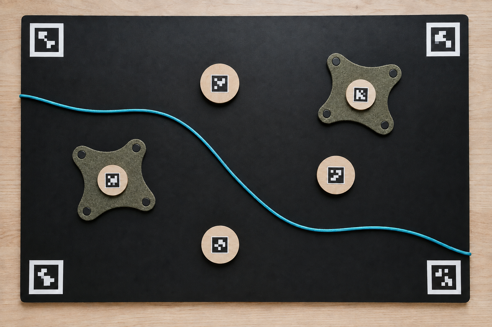
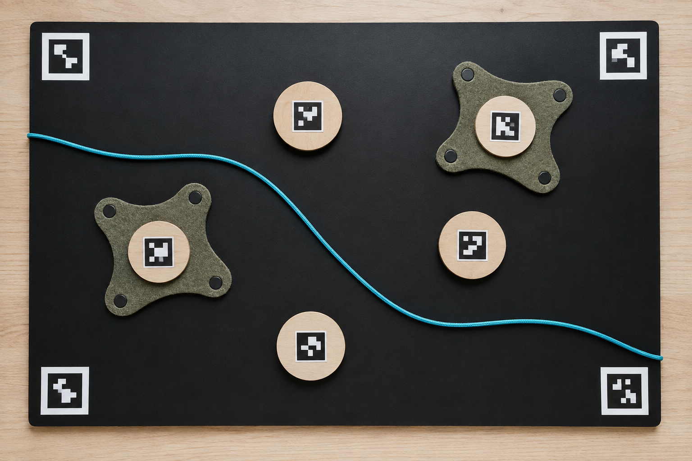
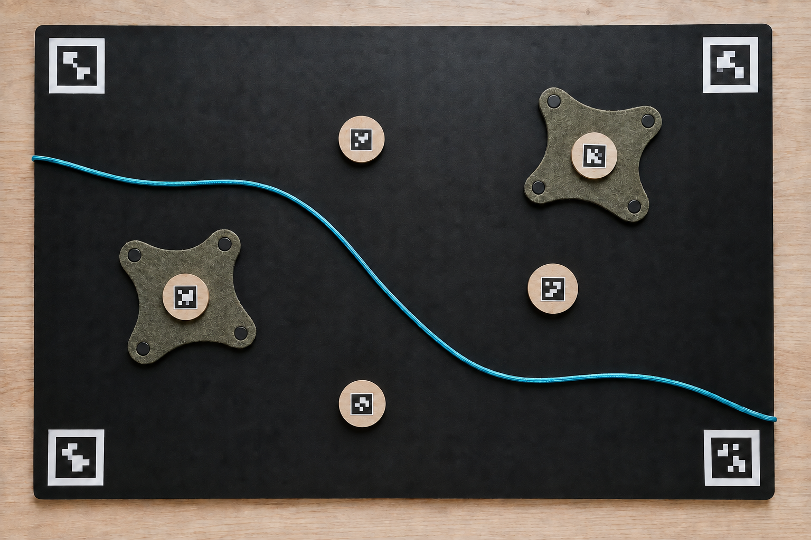
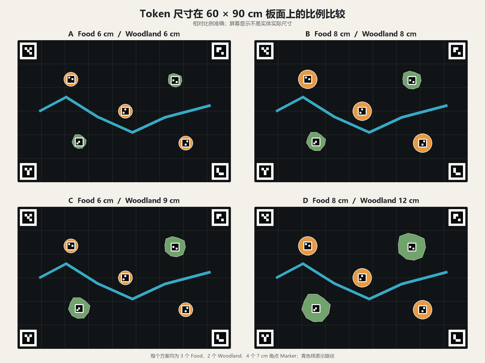
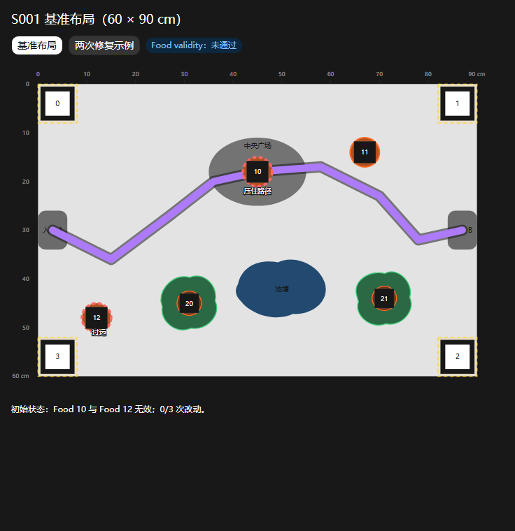

# Tangible Planning Prototype: Concept Iteration

This page records the design transition from the preliminary browser demo's
direct-feeding interaction toward a tangible urban-wildlife planning game. It
is process evidence only. The images do not prove that the physical prototype,
computer-vision pipeline, or Unity implementation has been completed.

## Current physical baseline

The working physical specification agreed on 7 September 2026 is:

- a 600 x 900 mm black magnetic board;
- 60 mm wooden planning tokens for human-use attractors such as benches,
  plazas, and food-related activity;
- 120 mm felt woodland patches with a 50 mm wooden centre hub and magnetic
  corner fixings;
- a 15 mm-wide, approximately 1,000 mm-long coloured path band;
- four printed ArUco corner markers for repeatable camera calibration; and
- 10 x 10 mm adhesive magnetic squares for attaching lightweight components.

The planning language is intentionally indirect: players place or reorganise
human facilities, woodland, and circulation routes, then observe how those
decisions affect people and animals. Food is treated as a consequence of human
activity and management rather than as an object placed directly for animals.

## Exploratory board renders

*Figure 1. Concept board v01: an early material and layout study.*

*Figure 2. Concept board v02: a second study of token, felt, and path-band
relationships.*

*Figure 3. Concept board v03: the wooden components were reduced after review.*

Figures 1-3 are AI-generated exploratory renders. They are retained in
chronological order as Research Through Design evidence. They are not accurate
scale drawings; marker graphics, quantities, shadows, and component proportions
are illustrative.

## Scale and baseline layout

*Figure 4. Relative-size comparison used to review 60 and 80 mm Food tokens and
60, 80, 90, and 120 mm Woodland tokens. Proportions are calculated against a
600 x 900 mm board, although display size on screen is not physical size.*

*Figure 5. S001 schematic baseline. This diagram records a planned test
arrangement rather than a camera capture of a completed prototype.*

The printable calibration sheet is available here:
[A4 four-corner ArUco calibration sheet](printables/tangible-prototype/aruco-four-corner-calibration-a4.pdf).
Marker IDs and print dimensions must be checked against the computer-vision
configuration before every recorded test.

## Relationship to the web demo

The browser demo remains useful evidence for testing:

- bilingual onboarding and explanatory language;
- a field journal and session-level research logging;
- visible immediate and delayed consequences;
- uncertain decisions without presenting one uniquely correct answer; and
- interactions between animal state, human activity, and shared conditions.

The following web-demo features are not direct implementation requirements for
the tangible P0 prototype:

- direct food throwing;
- seven simultaneous species;
- account saving and anonymous online presence;
- score-like use of four global condition meters; and
- the existing React component architecture.

The P0 tangible target instead concentrates on one 2D park map, repeatable
four-corner calibration, marker pose detection, coloured-path segmentation,
camera-to-game coordinate normalisation, two core planning conditions, three
animal state machines, basic human movement, one complete
Plan-Confirm-Run-Observe cycle, and minimum viable research logging.

## Provenance and authorship

The student selected the board format, materials, dimensions, planning-game
direction, component meaning, and revisions. Codex assisted on 7 September 2026
with comparative diagrams, AI-generated concept renders, layout visualisation,
documentation, and file organisation. The student reviewed the outputs and
requested changes including smaller wooden pieces, a 60 mm human-activity
token, and fabric woodland areas with magnetic corners.

