<!--
GitHub documentation copy generated from the Unity design workspace.
Confirmed text is authoritative; WebP files are compressed documentation
previews. Production PNG assets remain in the Unity project.
Last synchronized: 2026-09-21.
-->

# SYMBIOSIS: 49 — UI and Visual Decisions

**Document status:** living design record
**Last updated:** 21 September 2026
**Implementation target:** Unity desktop demo, 1920 × 1080

This document records visual and interface decisions confirmed with the project
owner. Update it whenever a new item is confirmed. Items not recorded as
confirmed remain open for later discussion.

## Reference direction

The approved direction is an **editorial ecological diorama**: a tactile,
handcrafted city model combined with a restrained game HUD. The map remains the
main visual subject, while permanent interface text is kept to a minimum.

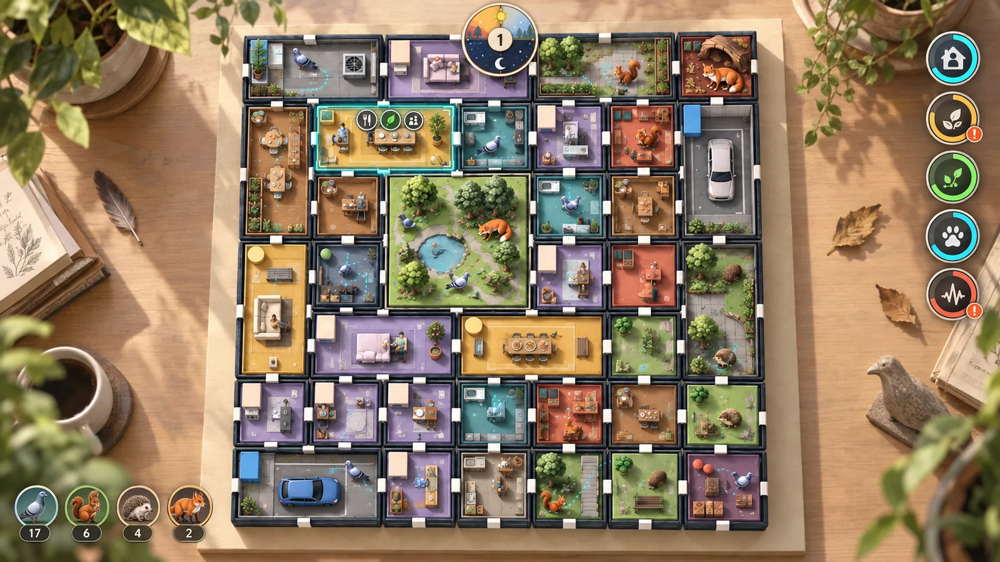

The reference image establishes mood and hierarchy rather than exact final
assets. All production UI elements must be exported separately rather than
baked into a single screenshot.

## Normal gameplay screen

- Do not display the game title in the upper-left corner.
- Do not display a Research Mode label during play.
- Remove the former blue top and bottom bars.
- Do not show settings or return-to-desktop controls during normal play.
- The 7 × 7 modular city board is the dominant visual element.
- Prefer icons, meters, colour and animation over persistent explanatory text.
- Longer labels and explanations appear only on hover or in contextual views.

### Gameplay camera

- Use a fixed elevated top-down viewing angle during normal play.
- Do not allow free camera rotation.
- Allow zoom with the mouse wheel and limited panning while holding the middle
  mouse button.
- Double-clicking a room or animal smoothly moves closer to the target.
- Right-click or Esc returns the camera to the complete 7 × 7 board view.
- In a close animal view, follow the selected animal with slow smoothing.
- Do not lock the animal rigidly to the exact screen centre; adjust the camera
  only as it approaches the edge of the comfortable viewing area.
- Right-click or Esc exits follow mode immediately and restores the full-board
  view.

## Desktop and mode selection

- Show the `SYMBIOSIS: 49` title only on the desktop/main menu.
- Use the modular city itself as a live, softly blurred background, viewed from
  an approximately 45-degree elevated top-down angle.
- The no-camera build presents Sandbox as the primary mode entrance and
  Research as the secondary entrance.
- The camera build contains Sandbox only. Replace the two mode entrances with a
  single Start entrance and do not expose Research anywhere in that build.
- Keep only Settings, Language and Exit beneath the mode entrances.
- After a mode is selected, move and fade the entrance UI towards the upper and
  lower edges of the screen.
- At the same time, bring the city background into focus, adjust the camera to
  the gameplay view and zoom in until the board becomes the active game scene.
- Do not cut to a visually unrelated loading screen during this transition.
- The transition into gameplay lasts approximately 1.8 seconds.
- During the first 0.5 seconds, the mode entrances move towards opposite screen
  edges and fade out.
- The city then comes into focus while the camera smoothly changes angle and
  zooms in.
- During the final 0.3 seconds, the gameplay HUD fades in.
- Use smooth ease-in/ease-out motion without an abrupt acceleration.
- The implemented prototype blocks menu raycasts throughout the transition,
  uses unscaled time so the 1.8-second motion still runs while the menu pauses
  simulation, and restores the exact card positions before the next visit.
- Returning to the desktop reverses the transition: fade out the HUD, zoom the
  camera back to the 45-degree menu view, soften the scene into blur, and fade
  the title and mode entrances in from the upper and lower edges.

## Build and input variants

- Produce two distinct versions of the application.
- **Camera build:** Sandbox only; physical 49-cell module recognition is the
  layout input.
- **No-camera build:** Sandbox and Research; mouse interaction is the layout
  input.
- The Unity project uses the no-camera variant by default. Add the scripting
  define `SYMBIOSIS_CAMERA_BUILD` only when producing the camera-recognition
  build; mode entry, restored saves and runtime mode selection then remain
  constrained to Sandbox.
- Both builds share simulation rules, ecological feedback and the approved
  visual system unless a build-specific rule is listed here.
- Adapt onboarding to the active input method rather than asking camera-build
  visitors to choose an input method.
- In the no-camera build, selecting Sandbox opens no parameter page. Play the
  approved 1.8-second transition and start from the default layout immediately.
- Allow the player to enter layout editing at any time after Sandbox begins.

## No-camera layout editing

- Enter layout editing through a dedicated board/edit pictogram.
- Pause the simulation while the layout is being edited.
- Allow movable rooms to be dragged into available positions.
- Allow 1 × 2 and 2 × 2 modules to rotate where their geometry permits.
- Show a lock mark on fixed modules.
- Enable the confirm/check action only when the whole layout is complete and
  legal.
- The cancel/cross action restores the layout that existed before editing.
- Neither confirming a new layout nor cancelling an edit starts a new run.
- After leaving the editor, resume the same simulation time, animal states,
  death count and research event record from immediately before editing.
- After a new layout is applied, animals retain their previous board
  coordinates rather than moving with room modules.
- Animals recalculate routes in response to the new surroundings.
- If an animal's coordinate becomes non-walkable, move it smoothly to the
  nearest legal position without counting this correction as a death.
- Furniture, food facilities, human occupants and the current functional state
  move with their complete room module.
- Treat a room as one persistent urban-function unit. Only wild animals retain
  their previous board coordinates when the layout changes.
- While editing, show one temporary holding tray outside the board. It must
  accept any single 1 × 1, 1 × 2 or 2 × 2 module.
- A player may move one module into the tray to create free cells for
  rearrangement.
- The holding tray must be empty before the confirm/check action is enabled.
- Selecting a movable module reveals a rotate control at its upper-right.
- Clicking the rotate control or pressing `R` rotates the module clockwise by
  90 degrees.
- Show a cyan-green placement preview for a legal rotated footprint.
- Show an orange-red preview and prevent placement when the footprint conflicts
  with another module or the board boundary.

## Per-room visual confirmation

- Confirm every room category separately before producing final room art.
- For each room, record its name, footprint, fixed/movable status, structure,
  floor and wall materials, furniture and props, human activity, animal use,
  room icon, colour family, and day/night appearance.
- Do not treat a general room-style reference as approval of individual room
  contents.

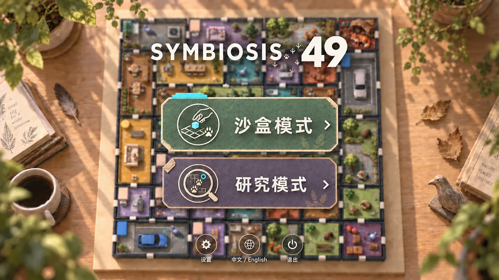

### Main-menu title and mode cards

- Keep the exact title `SYMBIOSIS: 49`, with `49` larger than the wordmark.
- Replace the conventional colon with a loose, shallow-curved trail of small
  urban-animal footprints in the open space before `49`.
- The footprints must feel naturally walked rather than arranged as icons:
  vary direction, spacing, scale, pressure and completeness, with left/right
  steps alternating where appropriate.
- Do not align the tracks vertically or symmetrically.
- Use the approved transparent seven-print trail
  `Images/UI/main-menu-title-footprints-v01.webp` between the live SYMBIOSIS
  wordmark and the separately enlarged live `49`. Do not render a conventional
  colon underneath or beside it.
- Use a matte moss-green paper card for Sandbox and a matte dusty-purple paper
  card for Research.
- Use the separate text-free transparent layer
  `Images/UI/main-menu-sandbox-card-v01.webp` for the approved Sandbox card
  backing; its mode icon, title and arrow remain independent UI layers.
- Use `Images/UI/main-menu-research-card-v01.webp` as the separate text-free
  transparent Research card backing, with the research pictogram and live
  bilingual label layered independently.
- Use warm-cream text and line art, clipped/layered paper corners, fine paper
  grain and short contact shadows.
- Avoid glassmorphism and bright cyan neon borders. A small cyan tab or detail
  may indicate the currently selected mode.
- Sandbox uses a hand placing a module into a grid as its icon concept.
- Use `Images/UI/main-menu-sandbox-icon-v01.webp` as the separate transparent
  Sandbox pictogram. Keep its cyan module accent and loosely curved three-print
  bird trail independent from the card backing and live labels.
- Research uses an observation lens over a grid and animal trail as its icon
  concept.
- Use `Images/UI/main-menu-research-icon-v01.webp` as the separate transparent
  Research pictogram, including the single cyan observation marker. Keep it
  independent from the purple card backing and live labels.
- Reuse `Images/UI/main-menu-enter-arrow-v01.webp` as the separate text-free
  enter chevron on both mode cards.
- Compose every card at runtime from its backing, pictogram, live bilingual
  mode label and shared enter chevron. If an unfinished save exists, show only
  the matching mode card and change its live label to Continue; otherwise the
  no-camera build shows both cards and the camera build shows one Start card.
- Settings, Language and Exit share the approved text-free circular paper
  backing `Images/UI/main-menu-round-button-base-v01.webp`. Their symbols,
  labels, hover response and disabled/pressed states remain separate layers.
- Settings uses the separate text-free paper gear
  `Images/UI/main-menu-settings-icon-v01.webp`; its round backing and live label
  are not baked into the icon.
- Language uses the separate text-free globe/conversation symbol
  `Images/UI/main-menu-language-icon-v01.webp`. It contains no embedded Chinese
  or English lettering, so both language states reuse the same image.
- Exit uses the separate text-free doorway and outward-arrow symbol
  `Images/UI/main-menu-exit-icon-v01.webp`. Its muted terracotta arrow is the
  only warning accent; the shared button backing and live label remain separate.

## Day and night clock

- Position: top centre.
- Form: an original circular dial divided into dawn, day, dusk and night arcs.
- A sun/moon pointer moves around the dial during the six-minute cycle.
- The centre displays the day number.
- Do not show a written time or a persistent day/night label.
- Each six-minute cycle uses four phases: 30 seconds of dawn, 2 minutes 30
  seconds of day, 30 seconds of dusk and 2 minutes 30 seconds of night.
- Day and night therefore occupy equal durations, with short transition arcs
  between them.
- Dawn assigns daily office and food-shop routes and residents leave home.
  During daytime they commute, work, visit their assigned food shop and return
  to finish work. Dusk is the return-home and completed-work checkpoint. Night
  contains the main fox and hedgehog activity, natural-food generation,
  scheduled municipal collection and final resource settlement before the next
  dawn.
- At sandbox speeds a complete day lasts six real minutes at 1x, three minutes
  at 2x and one minute 30 seconds at 4x. Layout editing, unstable camera-board
  recognition and the Esc menu pause the day clock.
- Use pale peach for dawn, muted golden yellow for day, terracotta orange for
  dusk and deep blue-grey for night.
- Keep the centre day-number disc warm off-white.
- Indicate the current phase with a brighter outer arc and a small sun/moon
  pointer.

### Scene lighting across the cycle

- Transition light angle and colour temperature smoothly through dawn and
  dusk.
- Shift the scene towards deep blue-grey at night without a neon colour wash.
- Light residences, offices and food shops according to their current use.
- Keep only restrained, soft illumination in parks and along roads.
- Add a slight night-time rim light to animal silhouettes so they remain
  readable against the model.

## Resource Point counter

- Place the compact Resource Point counter at the upper-left of the gameplay
  view, using the space deliberately left by removing the persistent game title.
- Show only the work-voucher icon and current balance during normal play.
  Hovering expands a small detail tag with the current value out of 20, expected
  end-of-day income and expected end-of-day spending.
- Resource Points use a warm-amber paper work voucher with a cream briefcase and
  circular return arrow, avoiding coin, banknote, gem and currency imagery.
- Use separate transparent assets for the base, gain, spend, insufficient and
  full-capacity states:
  `Images/UI/resource-point-base-v01.webp`,
  `Images/UI/resource-point-gain-v01.webp`,
  `Images/UI/resource-point-spend-v01.webp`,
  `Images/UI/resource-point-insufficient-v01.webp`, and
  `Images/UI/resource-point-full-v01.webp`.
- At the 20-point cap, switch to the full-capacity state with its closed arrow
  loop. The first transition may show `Full` once; later frames retain only the
  pictorial state.

## Global ecological indicators

The permanent HUD contains four global indicators, arranged vertically on the
right. Each uses a pictogram and a value ring. Names, exact values and reasons
appear on hover.

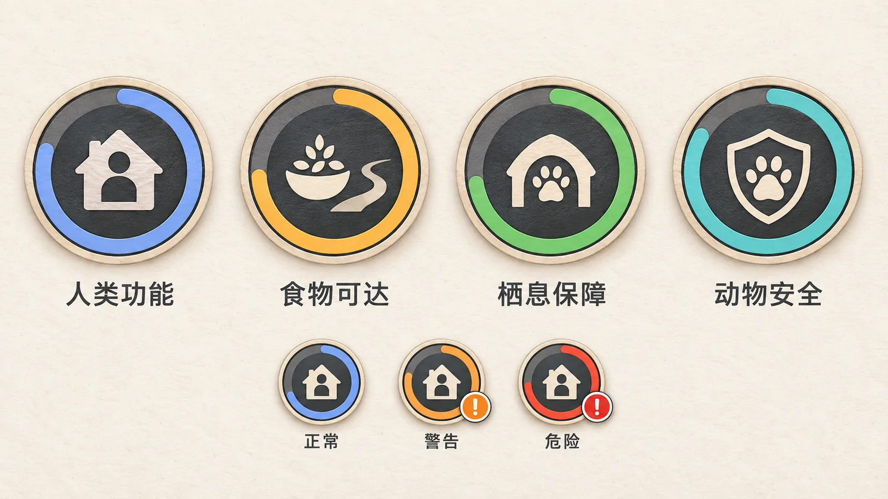

- Use one shared construction: deep graphite circular base, warm-cream paper
  rim and pictogram, a muted unfilled track, and a coloured progress ring.
- Give each category its own normal-state colour.
- Override the category colour with muted orange and a small warning pip during
  warning states.
- Override it with restrained brick red and a small critical pip during danger
  states.
- Production assets must omit the sample-sheet labels and background and be
  delivered as separate transparent UI elements.
- Animate progress-ring changes smoothly over approximately 0.5 seconds.
- Pulse once, subtly, when an indicator enters warning or danger; do not use a
  continuous flashing animation.
- At the same moment, show a short matching-colour ripple on the room that
  caused the change so the player can locate the source.

### Human function

- Icon: house plus person.
- Meaning: whether housing, work and service spaces remain functional.
- Degradation: windows progressively go dark as the condition falls.

### Food accessibility

- Icon: food or seed plus an access path.
- Meaning: how easily animals can reach food.
- Degradation: the access path develops gaps; an orange warning pip appears at
  a critical level.

### Habitat provision

- Icon: arched shelter plus a small paw print.
- Meaning: whether species can reach appropriate places to rest, hide or nest.
- Degradation: the shelter empties and the value ring develops an orange gap.
- This indicator must remain visually distinct from human housing.

### Animal safety

- Icon: paw print plus shield.
- Meaning: current risk of animal death.
- Degradation: the shield develops cracks; orange indicates danger and red is
  reserved for a death event.

### Removed global indicators

- **Green connectivity** is not a percentage. Do not colour the full reachable
  area. When an animal cannot pass a room or wall boundary, flash only that
  blocking edge briefly in orange.
- **Spatial disturbance** is not a percentage. Vehicles, crowds and similar
  events create temporary local pulses in the affected room.
- Do not add an overall coexistence score.

## Animal population HUD

- Position: lower-left corner.
- Show four species portraits: pigeon, squirrel, hedgehog and fox.
- Show only the current living population beside each portrait.
- Initial populations are 12 pigeons, 4 squirrels, 2 hedgehogs and 2 foxes,
  for 20 animals in total. The four pigeon habitat rooms conceptually support
  three starting pigeons each.
- After a death, dim the relevant portrait and use its outer ring as the
  20-second respawn countdown.
- In the research build, cumulative deaths are available in contextual detail,
  not as a large permanent label.

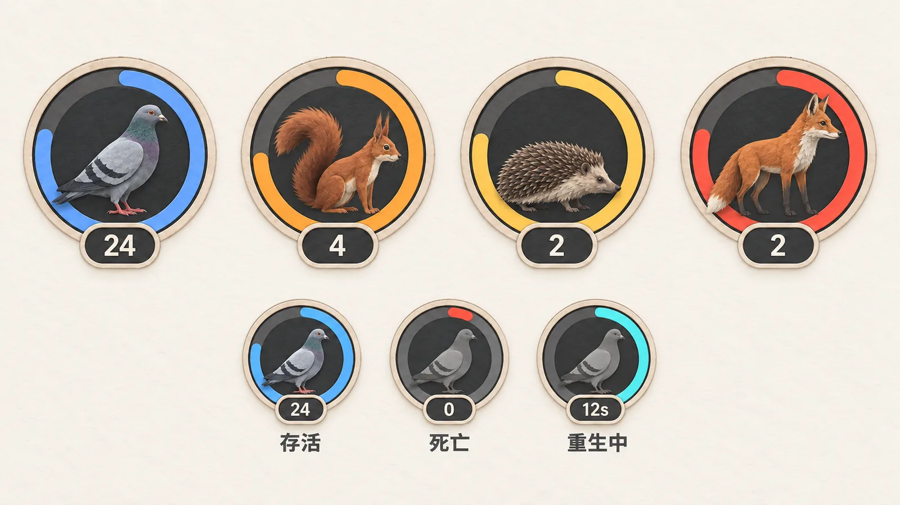

- Use mature, anatomically recognisable animals with layered paper-cut and
  restrained low-poly planes rather than cute mascot proportions.
- Keep eyes small, expressions neutral and silhouettes readable.
- Use blue-grey for the pigeon, rust orange for the squirrel, muted ochre for
  the hedgehog and terracotta red for the fox.
- Use the shared warm-paper rim and graphite-base construction established by
  the ecological indicators.
- Production assets must separate the animal portrait, count plaque, accent
  ring and respawn countdown arc.
- When one animal dies, flash its species portrait grey for approximately 0.3
  seconds and decrement the living count immediately.
- Restore the portrait colour after the flash and show the 20-second respawn
  progress on the outer ring.
- Keep the portrait desaturated only when the living count for that species is
  zero.
- If several animals of one species are waiting to respawn, show one small cyan
  pip per queued animal beside the portrait.
- Use the outer ring for the next respawn due rather than drawing several
  overlapping countdown rings.
- Remove one pip when an animal respawns and continue the ring with the next
  queued respawn.

## Room selection

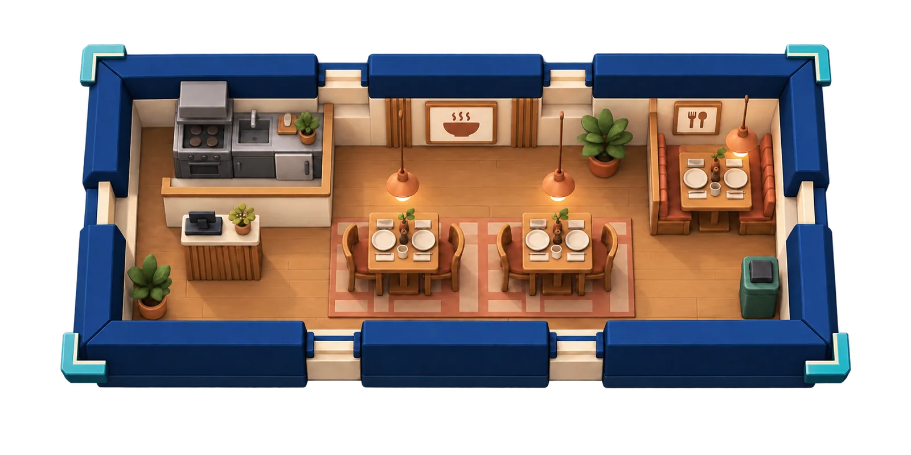

- A selected room receives four detached cyan-teal corner brackets outside the
  complete module. Do not draw a continuous outline or progress-like border.
- A 1 × 2 or 2 × 2 room uses four brackets around the room as one module, not
  separate brackets around each cell.
- Rotate and reuse the standalone transparent asset
  `Images/UI/room-selection-corner-v01.webp` for all four corners.
- Use a restrained opacity-only breathing animation. Do not scale the room or
  cover its floor, furniture, people or animals.
- Selection corners keep their cyan-teal/ivory treatment during layout editing;
  legal and illegal placement previews remain separate floor-state feedback.
- A short connector may be added only when contextual icons are present.
- Do not open a large permanent information panel.
- Show no more than three contextual icons above the room:
  1. room type;
  2. current function or relevant resource;
  3. current human or animal use.
- Use the approved three-icon Food Shop example as the layout reference:
  `Images/room-context-icons-sample-v01.webp`.
- Build the group from separate transparent layers: the shared circular chip,
  the room-type pictogram, the current-function pictogram, the current-use
  pictogram and the short connector. Approved Food Shop assets are:
  `Images/UI/room-context-chip-v01.webp`,
  `Images/UI/status-food-available-v01.webp`,
  `Images/UI/status-human-use-v01.webp` and
  `Images/UI/room-context-connector-v01.webp`.
- Only relevant icons appear. Empty icon slots are not shown.
- Names and detailed values appear on hover.
- Human figures are not individually selectable.
- Clicking a human selects that person's room instead.
- Express human state through room use and the global Human Function indicator
  rather than through individual human HUD cards.

## Minimal hover labels

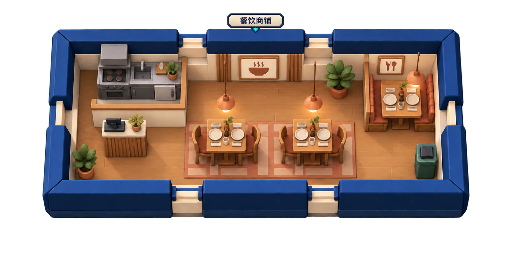

- Do not use automatic hover information cards during normal gameplay.
- After a 0.4-second hover delay, show only the room name in a small label.
- Use the blank transparent asset `Images/UI/room-hover-nameplate-v01.webp`;
  render Chinese or English room names dynamically on top of it.
- Clicking selects the room and reveals its contextual status icons.
- Keep detailed data in research results or development/debug views.
- Teach icon meanings during onboarding rather than repeating explanations in
  gameplay.
- Fade the name label in softly and out quickly after the pointer leaves.

### Food shops

- Use the category name **Food Shop** in English and **餐饮商铺** in Chinese.
- Fish-and-chip, kebab and Chinese-food shops are visual variations of one room
  category during the demo.
- They share the same food-provision and human-service rules in the demo.
- Use one generic icon: a two-person dining table with two place settings. Do
  not depict a cuisine-specific dish or storefront brand.
- Do not add a separate badge for cuisine type.

### Residence occupancy

- Use `Images/residence-occupancy-icons-sample-v02.webp` as the approved visual
  direction for residence occupancy. Both states use the same open architectural
  frame with no visible door leaf, handle or window grid.
- A softly lit amber opening means the residence is assigned to a resident;
  a muted blue-grey opening means it is vacant.
- Assemble the status chip from the shared circular backing and one dedicated
  transparent pictogram: `Images/UI/status-residence-occupied-v01.webp` or
  `Images/UI/status-residence-vacant-v01.webp`.
- Occupancy means the residence remains assigned even while its resident is
  elsewhere. Show the separate Human Use pictogram only while the resident is
  physically inside the room.
- Preserve `Images/residence-occupancy-icons-sample-v01.webp` as an alternate
  full-door exploration for possible later use; do not use it in the current
  runtime UI.

### Office daily production

- Use `Images/office-daily-production-icons-sample-v01.webp` as the approved
  office current-function reference.
- Every office has two daily production slots matching its two-worker capacity.
  Show both as hollow cream octagonal paper tokens at dawn, fill the first in
  amber after one assigned resident completes the full daily loop, and fill
  both after two residents complete it. Each filled token carries the same
  small teal paper fold as the global Resource Point visual.
- Reset both tokens at the next dawn. Do not infer completion merely because a
  resident is physically inside the office; current human presence remains the
  separate Human Use pictogram.
- Assemble the second contextual chip from the shared circular backing and one
  dedicated transparent state asset:
  `Images/UI/status-office-production-0-v01.webp`,
  `Images/UI/status-office-production-1-v01.webp`, or
  `Images/UI/status-office-production-2-v01.webp`.

### Supermarket waste route

- The supermarket has no separate open/closed or customer-service state. Do
  not occupy a contextual slot with a permanent operating icon.
- Use `Images/supermarket-waste-route-icons-sample-v01.webp` as the waste-route
  explanation reference. The continuous teal route is explanatory only and is
  not shown during normal play.
- When no reachable waste room exists, show the shared second-chip warning
  `Images/UI/status-waste-route-blocked-v01.webp`: a grocery crate and closed
  municipal bin separated by one clear amber route gap. Hide it immediately
  after a reachable route is restored.
- The warning represents route connectivity, not current waste amount. Live
  fill remains an in-world property of the destination waste room.

### Garage directional service

- Use `Images/garage-directional-connections-sample-v01.webp` as the approved
  garage current-function reference. The function chip shows a fixed cream
  four-way hub and four small directional nodes corresponding to the physical
  top, right, bottom and left sides of the garage module.
- An inactive direction uses a hollow graphite node. Replace it with the teal
  active node only when that side shares a boundary with a Residence, Office
  or Food Shop receiving vehicle-range access from this garage. Other adjacent
  room types do not activate a node.
- Build the icon from independent transparent layers:
  `Images/UI/status-garage-connection-hub-v01.webp`, four instances of
  `Images/UI/status-garage-connection-node-inactive-v01.webp`, and one active
  replacement per serviced side using
  `Images/UI/status-garage-connection-node-active-v01.webp`.
- Do not show a number. Node position communicates direction and count. Keep
  the garage's continuous animal collision risk as an in-world vehicle event;
  it is not part of this service-connection chip.

### Waste-room contextual status

- Use `Images/waste-room-single-context-chip-sample-v01.webp` as the approved
  selected-room hierarchy for a normally operating waste room.
- Show only its room-type chip in the normal state. Read the current load from
  the in-world number, height and disorder of bins and tied bags; do not repeat
  that fill level in a second contextual chip.
- Municipal collection timing remains the shared rubbish-truck HUD event. A
  disconnected producer uses the shared Waste Route Blocked warning on that
  producer rather than adding a permanent route chip to the destination waste
  room.
- Temporary exceptional states such as overflow may add a warning treatment
  later, but empty contextual slots are never shown.

### Central Park contextual status

- Use `Images/central-park-single-context-chip-sample-v01.webp` as the approved
  selected-room hierarchy for the fixed Central Park.
- Show only one circular room-type chip containing the park's trees and pond
  while the park is selected. Do not add permanent icons for ecology,
  greenness, habitat quality or normal operation because they repeat the room's
  identity without communicating a changing gameplay state.
- Keep the chip hidden during normal unselected play. The standard delayed
  hover label supplies the room name, and the four cyan-teal corner brackets
  indicate selection.
- A second chip may appear only for a real temporary exception reported by the
  simulation, such as habitat failure. Never display an empty or placeholder
  status slot.

### Pigeon-habitat daily seed status

- Use `Images/pigeon-habitat-seed-status-sample-v01.webp` as the approved
  selected-room comparison for the pigeon habitat's daily food function.
- The first contextual chip remains the pigeon-habitat room type. The second
  chip shows the state of that habitat's one pigeon-only seed portion for the
  current game day.
- Show a shallow cream feeding dish containing a small cluster of warm ochre
  seeds, with a restrained teal availability accent, while the portion remains
  available. After a pigeon consumes it, replace the pictogram with the same
  empty dish using a muted graphite interior until the next dawn.
- Use the separate transparent pictograms
  `Images/UI/status-pigeon-seed-available-v01.webp` and
  `Images/UI/status-pigeon-seed-depleted-v01.webp` over the shared circular chip
  backing. The depleted state is neutral rather than a warning: do not add a
  red cross, danger colour or progress bar.
- Show these contextual chips only while the pigeon habitat is selected. The
  seed state also remains visible in-world through the feeding dish, so no
  permanent board-wide HUD marker is required.

### Shrub-habitat insect status

- Use `Images/shrub-habitat-insect-status-sample-v01.webp` as the approved
  selected-room comparison for the shrub habitat's natural-food function.
- The first contextual chip remains the shrub-habitat room type. The second
  chip shows whether one insect-food portion is currently present in that
  habitat.
- Show an olive leaf carrying one warm-ochre beetle, with a restrained teal
  availability accent, while the portion is present. Show the same empty,
  slightly desaturated leaf when the nightly 50% spawn did not occur or after
  an animal consumes the portion.
- Use the separate transparent pictograms
  `Images/UI/status-shrub-insect-present-v01.webp` and
  `Images/UI/status-shrub-insect-absent-v01.webp` over the shared circular chip
  backing. The empty leaf is a neutral state rather than a failure warning.
- Show these contextual chips only while the shrub habitat is selected. Do not
  add a hedgehog portrait, percentage, timer, red cross or permanent board-wide
  marker.

### Fox-den underground rest occupancy

- Use `Images/fox-den-rest-occupancy-sample-v01.webp` as the approved
  selected-room comparison for the fox den's concealed resting state.
- The first contextual chip remains the fox-den room type. The second chip
  contains two small front-facing fox-head positions representing the den's two
  underground resting hollows.
- Use a muted graphite hollow fox-head silhouette for an unoccupied position
  and a filled rust-orange head with cream cheeks for a fox currently resting
  underground. Show zero, one or two filled heads without adding numerals or a
  progress ring.
- Use the separate transparent pictograms
  `Images/UI/status-fox-rest-0-v01.webp`,
  `Images/UI/status-fox-rest-1-v01.webp` and
  `Images/UI/status-fox-rest-2-v01.webp` over the shared circular chip backing.
- The status counts only foxes currently concealed inside the den. Foxes moving
  visibly through the room or elsewhere on the board do not fill a position.
  Show the occupancy chip only while the fox den is selected.

### Oak-habitat tree growth status

- Use `Images/oak-habitat-growth-status-sample-v01.webp` as the approved
  selected-room comparison for the oak habitat's four tree stages.
- The first contextual chip remains the oak-habitat room type. The second chip
  shows the room's live tree stage without numerals, progress bars or countdown
  rings.
- The four states are: a felled empty plot with disturbed earth and no permanent
  stump; a newly planted small sapling; a half-height young tree with a compact
  faceted crown; and the full mature oak with its readable root hollow and one
  small acorn accent.
- Use the separate transparent pictograms
  `Images/UI/status-oak-felled-v01.webp`,
  `Images/UI/status-oak-sapling-v01.webp`,
  `Images/UI/status-oak-young-v01.webp` and
  `Images/UI/status-oak-mature-v01.webp` over the shared circular chip backing.
- Planting costs six resource points. The planted sapling becomes a young tree
  after one complete game day and mature after two complete days. Only the
  mature state restores squirrel climbing, caching, safe-habitat use and daily
  nut production.
- Show the growth chip only while the oak habitat is selected. Keep the same
  surrounding room props and open route across stages so the changing tree is
  the only gameplay-bearing visual difference.

## Animal selection

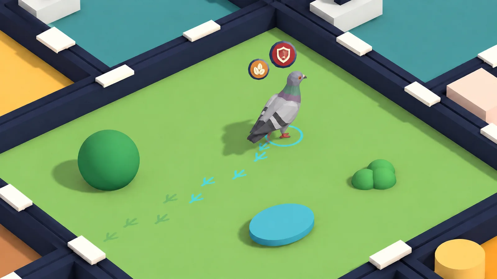

- A selected animal receives a thin cyan ground ring.
- Food, habitat and safety need icons appear above the animal only when a need
  is falling or danger is present.
- Healthy, ordinary behaviour should remain visually quiet.
- Do not show movement footprints in the normal full-board view.
- Show species-specific footprints only after entering the close animal-follow
  camera.
- Retain approximately the latest six seconds of movement as faint cyan prints,
  fading progressively with age.
- Fade all movement prints out when follow mode ends.
- Keep death-location prints dark red with a ripple so they cannot be confused
  with movement prints.
- Show need icons only for the selected animal.
- Arrange up to three icons in a small arc above the animal: food, habitat and
  safety.
- Hide needs that are within a normal range.
- Use orange for warning and red for danger.
- Place the most severe active need in the central position.
- Use separate transparent production layers for the ring and species tracks.
  The approved pigeon assets are `Images/UI/animal-selection-ring-v01.webp`
  and `Images/UI/pigeon-footprint-v01.webp`.
- Use three separate transparent warning layers:
  `Images/UI/animal-need-hunger-warning-v01.webp`,
  `Images/UI/animal-need-habitat-warning-v01.webp`, and
  `Images/UI/animal-need-safety-danger-v01.webp`.
- Keep all need warnings hidden until the live simulation reports an actual
  warning or danger state. Do not display placeholder or randomly generated
  warnings in the demo.

## Death and respawn feedback

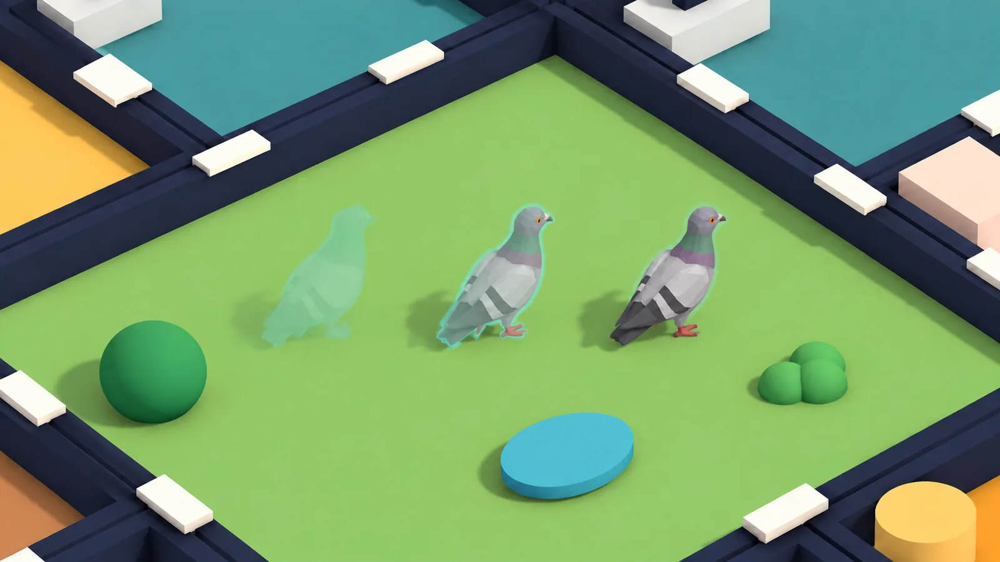

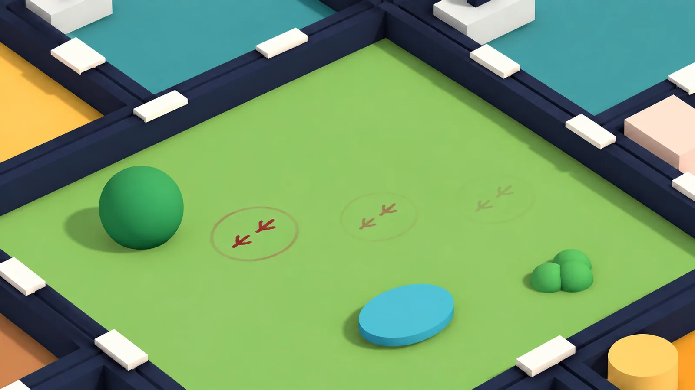

- A standard run has two independent failure conditions: the resource balance
  becomes negative after daily settlement, or the run reaches five animal
  deaths. Whichever happens first opens the results screen.
- The death limit counts death events rather than unique animals, so the same
  respawned animal can add another death later. Deaths one through four retain
  the 20-second respawn flow; the fifth death ends the run immediately and does
  not wait for that respawn.
- Every species dies from starvation after three complete game days without
  eating. Species differ in food sources, foraging and escape behaviour, but
  share this readable starvation limit.
- Each individual needs one food portion per game day. Missing a daily meal adds
  one hunger day; consuming any valid portion resets the individual's hunger
  counter to zero.
- Do not show blood or graphic injury.
- On death, the animal becomes a briefly desaturated silhouette and dissolves.
- Leave a small red event marker at the location.
- Dim the species portrait and start its 20-second countdown ring.
- Pigeons respawn near a pigeon house; foxes near the fox den; squirrels and
  hedgehogs near the central park or another suitable green habitat.
- Respawn chooses a free point in a currently valid species habitat rather than
  necessarily the original spawn. Foxes always return to the den, and squirrels
  never respawn in a felled tree plot.
- A respawned animal starts with zero hunger days and a normal safety state. A
  respawned squirrel does not inherit the dead squirrel's personal cache and
  must establish a new one.
- Respawn feedback is a short cyan breathing glow plus the species silhouette.
- The respawn feedback lasts approximately one second: a faint cyan silhouette
  appears first, the normal animal resolves inside it, and the body-hugging
  cyan outline then fades. It is not a ground selection ring.
- Avoid magical particles.
- Mark a death location with a small dark-red footprint stamp and one thin
  outward ripple.
- Fade the in-game marker out after approximately five seconds.
- The production marker uses two independent transparent layers:
  `Images/UI/death-pigeon-footprint-v01.webp` and
  `Images/UI/death-ripple-v01.webp`. Place exactly two footprints and one ripple;
  do not construct a body imprint or a ring from repeated geometry.
- Retain the same footprint stamp on the research-results map to show every
  death location.
- Do not use a skull, gravestone or graphic injury symbol.

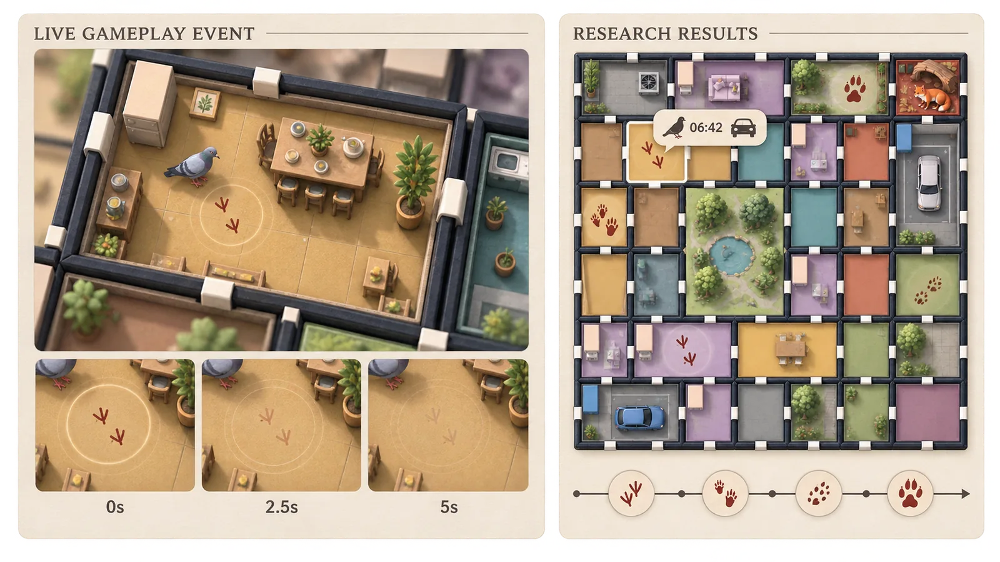

- Use naturally imperfect, species-specific tracks where their silhouettes are
  readable: pigeon toes, fox paw, squirrel prints and small hedgehog steps.
- Selecting a retained marker on the results map shows only the species,
  incident time and a small cause pictogram.
- Keep the live marker, ripple, results marker, selection outline and detail tag
  as separate production assets.

## Research death limit

- Do not display a Research Mode label.
- Represent the configured death limit with a row of hollow death markers near
  the animal HUD.
- Fill one marker after each death.
- When all markers are filled, automatically enter the results view.
- The default research limit is five deaths unless changed in research setup.
- The default 18-minute research duration counts active simulation time, equal
  to three complete six-minute days at the locked 1x speed. Layout editing,
  recognition pauses and the Esc menu stop this research-duration counter.
  Record real elapsed pause and layout-edit time separately as operation time
  in the exported research log.
- Add a thin muted-purple research-duration ring outside the existing day/night
  clock. It shrinks across the full configured session while the inner clock
  continues to show the current six-minute day cycle.
- Change the duration ring to amber with two minutes remaining and pulse it once
  subtly at 30 seconds. Do not flash continuously.
- Keep the exact remaining time hidden during normal play; hovering the outer
  ring reveals it. Sandbox mode omits this ring entirely.
- Export the research-duration ring as a separate UI layer from the day/night
  clock artwork.

## End-of-run results

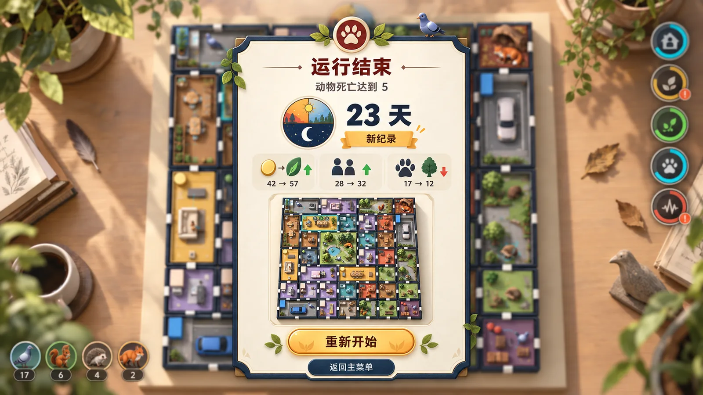

- Sandbox play has no fixed victory day or proactive win condition. A run
  continues until one of its failure conditions is reached, and days survived
  serve as the main result.
- The results screen first states which failure condition ended the run: five
  animal deaths or a negative end-of-day resource balance.
- It then shows days survived, final resident population, cumulative resource
  income and spending, room movements, trees felled and planted, and deaths by
  species.
- The longest survival in completed runs is stored permanently and displayed
  on the main menu and results screen. Mark a run when it establishes a new
  record; restarting a failed run does not clear the record.
- Present a compact key-parameter summary rather than only raw event totals:
  resource production, food-shop operation cost, layout and planting spending,
  final balance and peak balance; final and peak residents, average commute
  efficiency, arrivals, relocations and departures; animal deaths by species
  and cause, average habitat provision, and felled, planted and matured trees.
- Use grouped pictograms, short values and small trend lines where useful; do
  not turn the results screen into a spreadsheet or expose raw simulation logs.
- Include a small top-down thumbnail of the final 49-cell layout beside the
  parameter summary so the player can relate the outcome to the final spatial
  arrangement.
- The primary action is labelled **Restart / 重新开始**. It clears the failed
  run and begins a new session from day one; the button does not need to state
  "from day one" in its visible label.
- A smaller secondary **Main Menu / 返回主菜单** action remains available on the
  results screen.
- The approved hierarchy is ending reason, days survived and record state,
  three compact live-data groups, final-layout thumbnail, then the two actions.
  Values in the concept image are illustrative only; the Unity view must bind
  to the actual completed run and must never hard-code sample statistics.
- Switch the ending-reason emblem from the live end condition. The approved
  transparent layers are `Images/UI/results-end-animal-deaths-v01.webp` and
  `Images/UI/results-end-negative-resources-v01.webp`. Keep the numeric death
  limit and balance value in adjacent live text rather than baking numbers into
  either icon.
- Use `Images/UI/results-days-survived-v01.webp` beside the live survival-day
  value. Use `Images/UI/results-new-record-ribbon-v01.webp` only when the run
  exceeds the stored record. The ribbon remains text-free in the asset so the
  localized `新纪录 / New record` label can be rendered live.
- Use three transparent pictograms for the compact summary groups:
  `Images/UI/results-summary-resources-v01.webp`,
  `Images/UI/results-summary-residents-v01.webp`, and
  `Images/UI/results-summary-ecology-v01.webp`. The ecology tree must follow the
  approved broad clustered-canopy tree style rather than a conical silhouette.
- Frame the live final-layout capture with
  `Images/UI/results-layout-thumbnail-frame-v01.webp`; keep the captured board
  visible through its transparent centre and inset it from the decorative edge.
- Use `Images/UI/results-restart-button-v01.webp` and
  `Images/UI/results-main-menu-button-v01.webp` as decoration behind live,
  localised button labels. The image layers must remain text-free.
- Use `Images/UI/results-main-card-v01.webp` as the text-free decorative backing
  of the central result sheet and `Images/UI/results-summary-card-v01.webp` as
  the repeated backing for all three compact statistic groups. Keep both as
  independent image layers behind live data.
- Reveal the results with unscaled time after gameplay is paused: dim the board
  and ease the card from 92% to full size over 0.35 seconds, then reveal the
  ending reason, survival days, statistic groups, final-layout capture and
  actions in that order. Keep the full transition close to one second, with no
  shake, repeated flashing or exaggerated bounce.
- Play one restrained, non-looping result cue when the reason appears: a low
  wooden impact with soft wing rustle for the animal-death limit, or two
  descending token taps for a negative resource balance. When a new survival
  record is present, add one short warm chime after the statistic groups. Never
  use animal distress sounds; all cues obey the master volume and mute state.
- Keep both result actions disabled until the reveal finishes. On hover or
  keyboard focus, tint the button artwork slightly warmer with only a 1.5%
  lift; on press, compress its visual layer to 96% without changing the actual
  hit area, and play one short wooden click. Restart and Main Menu execute
  directly without another confirmation dialog because the run has ended.
- Restart clears the completed run, restores the initial layout and overview
  camera, and begins again at day one while preserving profile records and
  settings. Returning from results marks the failed session as completed and
  removes its resumable save; the main-menu action then reads Start New Game,
  while an ordinary mid-run return continues to read Continue Previous Sandbox.
- Cover both result exits with the same dark-navy curtain: 0.25 seconds to
  opaque, switch state while covered, then 0.25 seconds back to clear. Use
  unscaled time so the transition remains smooth while simulation time is zero.
- Place a compact longest-survival record below the main-menu entry action,
  reusing the approved survival-days pictogram with live bilingual text. Show
  `尚无记录 / No completed record` before the first completed run rather than
  displaying zero days. Commit a new record to the profile before refreshing
  the result badge or menu value.
- Back the main-menu record with the separate transparent asset
  `Images/UI/main-menu-best-record-panel-v01.webp`; its inset icon and bilingual
  value remain independent live UI layers.

## Research results view

- Enter this view when the first of three conditions occurs: the configured
  research time expires, the configured animal-death limit is reached, or the
  resource balance becomes negative during end-of-day settlement.
- Pause the simulation and reduce the brightness of the live board behind the
  results.
- Present the results as a central research-record sheet.
- Record the exact ending reason, elapsed and unused research time, final
  resource balance and death count. Treat time expiry as normal completion and
  the other two conditions as early termination, but do not label any outcome
  as a victory or failure.
- Show initial and final layout thumbnails.
- Compare the initial and final values of the four global indicators.
- Show deaths by species.
- Show the location and time of each death on a compact timeline.
- Do not calculate an overall score.
- Do not label the outcome as success or failure.
- Place three actions at the bottom of the record: Restart, Export Research
  Record and Return to Desktop.
- Use an icon plus a short text label for each action.

## Research record export

- Create a separate folder for every research session.
- Identify a session only with an anonymous participant code and timestamp; do
  not record a participant name.
- Export a CSV event table containing time, module changes, indicator changes,
  and every animal death with species, location and cause.
- Export JSON containing initial and final layouts, research settings and the
  complete event record.
- Export a PNG capture of the results view for portfolio and presentation use.

## Anonymous participant code

- Before a research session starts, show a compact setup card.
- Suggest sequential anonymous codes such as `P001` and `P002` automatically.
- Allow the researcher to edit the suggested code.
- Use the code only for research exports.
- Do not show the participant code during normal gameplay.

## Research setup parameters

- On the pre-session setup card, show research duration with a clock icon.
- Default duration: 18 minutes.
- Show the maximum death count with a death-marker icon.
- Default maximum: five deaths.
- Adjust both values with left and right arrows rather than free text entry.
- Lock the values after the session starts.
- Do not allow parameter changes during the research session.
- In the no-camera build, selecting Research expands the existing dusty-purple
  mode card in place rather than navigating to a separate page.
- The expanded card contains participant code, duration, death limit and Start.
- Returning collapses the setup card back into the original mode entrance.

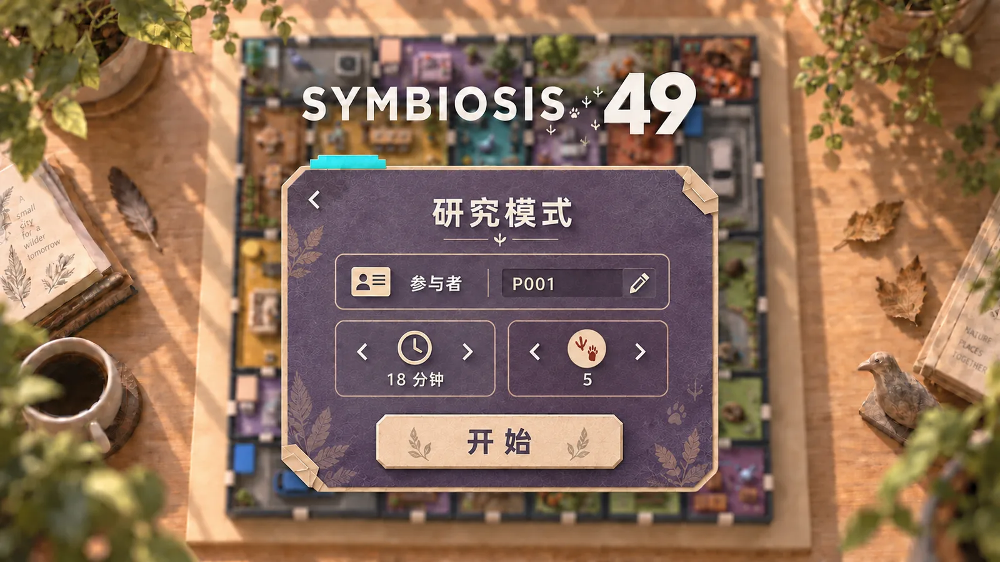

- Use the approved expanded dusty-purple paper card as the production layout.
  Preserve the anonymous participant-code row, paired duration/death-limit
  controls, restrained cyan tab, single Start action and back arrow.
- Use the established species-track death marker rather than a generic paw icon
  so the configured number cannot be mistaken for current animal population.

## Simulation speed

- Sandbox mode provides pause, 1×, 2× and 4× speeds.
- Research mode is locked to 1× for comparable observations.
- Position the controls beneath the day/night clock.
- Use compact `▶`, `2×` and `4×` symbols; highlight the active speed with a cyan
  ring.

## Camera recognition feedback

- Use `Images/camera-recognition-feedback-sample-v01.webp` as the approved
  three-state sequence reference, not as a flattened runtime overlay.
- Keep recognition feedback hidden while the physical board is stable.
- When modules move, show a brief cyan scan around the board.
- A valid stable layout flashes a green confirmation outline once.
- For incomplete, overlapping or illegal layouts, highlight only the affected
  room and conflicting cells in restrained amber. Keep red reserved for animal
  death and run failure.
- Avoid modal explanations during ordinary recognition.
- In the camera build, pause the simulation automatically as soon as physical
  module movement is detected.
- Keep the simulation paused while the recognised layout is incomplete or
  unstable. Do not advance time or trigger animal deaths during this pause.
- When a complete legal layout remains stable for approximately 1.5 seconds,
  apply it automatically and resume the same run from its previous state.
- Visualise the stable-recognition interval with a thin cyan progress trace
  travelling around the board perimeter.
- Reset the trace immediately if another physical movement is detected.
- When the perimeter trace completes, flash the outline green once and resume
  the simulation. Do not show a numeric countdown.
- Build the perimeter from dedicated transparent sprites:
  `Images/UI/camera-recognition-perimeter-cyan-v01.webp` for movement/stability
  progress and `Images/UI/camera-recognition-perimeter-green-v01.webp` for the
  confirmation flash. Reveal the cyan sprite clockwise using the runtime
  progress value; fade the green sprite once over approximately 0.55 seconds.
- Use `Images/camera-invalid-placement-feedback-sample-v01.webp` as the approved
  invalid-placement scene reference. Assemble each affected-cell overlay from
  `Images/UI/camera-recognition-invalid-placement-amber-v01.webp`; pulse only its
  opacity gently so the room contents remain readable.
- Recognition exposes Scanning, InvalidPlacement, Stabilising and Confirmed
  states to the HUD. Scanning, InvalidPlacement and Stabilising pause the clock;
  Confirmed resumes the current run before its green visual finishes fading.

### Camera calibration screen

- Use `Images/camera-calibration-screen-sample-v01.webp` as the approved layout
  reference, not as a flattened runtime screen.
- Show calibration on the first camera-build launch or when recognition fails.
- Display the live top-down camera image with four alignment corners and a
  translucent 7 × 7 grid overlay.
- Outline recognised modules in thin green and unresolved areas in orange.
- Enable Start only after all 35 physical modules are recognised.
- Keep instructions primarily visual and avoid paragraph-length calibration
  text.
- Assemble the screen from independent runtime layers: the approved camera
  recalibration pictogram, four rotated room-selection corner sprites, six
  vertical and six horizontal cyan grid traces, 49 state overlays, the shared
  navy button backing, and the approved paper-triangle Continue pictogram.
- Until the recognition module supplies a live preview and cell states, leave
  the camera area neutral and Start disabled; never populate it with simulated
  success data in the demo.

## Esc menu

- Pressing Esc pauses the simulation and softly dims or defocuses the board.
- The central pause panel contains: Continue, Settings, Language and Return to
  Desktop.
- Menu actions use an icon plus a short text label to avoid ambiguous clicks.
- Use the approved text-free transparent panel backing
  `Images/UI/pause-menu-panel-v01.webp`. The pause title, four actions and every
  interaction state remain separate runtime layers.
- Continue, Settings, Language and Return to Desktop share the approved
  text-free backing `Images/UI/pause-menu-button-base-v01.webp`; each action uses
  a separate pictogram and live bilingual label above this layer.
- Continue uses the approved single-triangle paper pictogram
  `Images/UI/pause-menu-continue-icon-v01.webp`. Do not use the rejected circular
  replay-like draft.
- Pause-menu Settings uses the separate light-on-dark gear pictogram
  `Images/UI/pause-menu-settings-icon-v01.webp`; do not reuse the dark-on-light
  main-menu version on the navy button.
- Pause-menu Language uses the separate light-on-dark globe/conversation
  pictogram `Images/UI/pause-menu-language-icon-v01.webp`, with no baked language
  characters or abbreviations.
- Return to Desktop uses `Images/UI/pause-menu-return-desktop-icon-v01.webp`:
  exactly four solid warm-cream tiles in a strict 2-by-2 arrangement, paired
  with one dusty-purple curved arrow pointing down toward their centre. Do not
  substitute a doorway/exit symbol or the rejected three-opening board draft.
- Language uses a globe icon and displays the current choice as `中文` or
  `English`. Changes apply immediately and are saved.
- Settings contains one master-volume slider and a mute button for the demo.
- Volume changes apply immediately and are saved.

### Settings panel presentation

- Open Settings as a centred matte-paper panel over a softly blurred game or
  desktop background rather than navigating to a separate full-screen page.
- Use the approved wide, text-free backing
  `Images/UI/pause-menu-settings-panel-v01.webp`. It keeps the pause panel's
  warm handmade paper, navy inset border, moss tab and small dusty-purple fold,
  but changes to a landscape proportion so every setting remains a separate
  runtime layer with generous spacing.
- Show only master volume, mute, language and back in both builds.
- Add Recalibrate Camera only in the camera build.
- The camera-only Recalibrate Camera row uses
  `Images/UI/pause-menu-camera-recalibrate-icon-v01.webp`: a warm-cream
  folded-paper camera framed by four dusty-purple registration corners. The
  action raises the camera-recalibration request consumed by the recognition
  module; the no-camera build neither shows nor dispatches it.
- Master volume is a real draggable Unity Slider assembled from three separate
  transparent paper-craft sprites: `Images/UI/pause-menu-volume-slider-track-v01.webp`,
  `Images/UI/pause-menu-volume-slider-fill-v01.webp` and
  `Images/UI/pause-menu-volume-slider-handle-v01.webp`. The navy track stays
  fixed, the moss fill changes length, and the dusty-purple handle follows the
  current value; do not bake a percentage or speaker icon into these layers.
- Mute is a stateful button. When sound is active, show
  `Images/UI/pause-menu-mute-icon-v01.webp` (warm-cream speaker crossed by one
  dusty-purple slash) with the live label Mute/静音. When sound is muted, swap
  to `Images/UI/pause-menu-restore-sound-icon-v01.webp` (the same speaker with
  exactly two dusty-purple waves) and the live label Unmute/取消静音.
- The Settings language row reuses the already approved
  `Images/UI/pause-menu-language-icon-v01.webp` and the shared pause-menu button
  backing. Its live label shows `语言 · 中文` or `Language · English`; do not
  create a near-duplicate globe asset for this screen.
- Back uses `Images/UI/pause-menu-back-icon-v01.webp`, a single warm-cream
  left-pointing folded-paper arrow with a small dusty-purple tail facet. It
  returns only to the pause menu and must not reuse the four-tile Return to
  Desktop symbol.
- Match the established paper texture, warm-cream line art and restrained
  shadows used by the mode-selection cards.

## UI asset production rules

- Generate and store every UI element as a separate asset.
- Do not deliver a single flattened HUD image for implementation.
- Export pictograms, rings, warning pips, clock parts, animal portraits,
  selection brackets, connectors, death markers and menu controls separately.
- Use transparent PNG for raster UI unless an editable vector is deliberately
  produced later.
- The documentation-only room-icon overview is
  `Images/UI/room-icons-overview-v01.webp`; never use this flattened sheet at
  runtime. Unity loads the eleven individual copies from
  `Assets/Resources/UI/RoomIcons/`.
- Separate visual states when Unity needs independent control: normal, hover,
  selected, warning, critical, disabled and filled/empty where applicable.
- Keep source assets large enough for 1920 × 1080 presentation and downscale in
  Unity rather than enlarging small files.
- Produce four cursor states as separate assets: standard arrow, open hand for
  selectable objects, closed hand while dragging a module, and an orange-red
  prohibited state for invalid placement.
- Keep module rotation on the contextual rotate control rather than changing
  the cursor again.

## Character and animal animation direction

### Required concept-to-model workflow

- Create a production-feasible concept sheet before building or rebuilding any
  subsequent 3D character, animal, room prop or environment model.
- Show one 45-degree gameplay view plus the orthographic views and key poses
  needed to judge silhouette, proportion and articulation.
- Do not begin the Blender production model or replace the Unity asset until
  the user confirms the concept direction.
- Design concept forms as explicit low-poly volumes and simple rig segments;
  avoid details that only work as painted illustration.
- Preserve rejected and superseded source versions with versioned filenames.
- After approval, validate the finished model against the concept, real-world
  scale and the 45-degree Unity gameplay camera before treating it as final.

- Treat one Unity world unit as approximately one metre and one board cell as
  3.1 metres across.
- Keep the benchmark citizen at approximately 1.72 metres tall, or 56% of one
  cell edge.
- Keep the pigeon at approximately 0.43 metres long, or 14% of one cell edge.
- Target approximately 0.38 metres for squirrels, 0.25 metres for hedgehogs and
  0.95 metres for adult foxes.
- Never enlarge a model to make it clickable or readable. Enlarge the invisible
  collider, selection ring or camera close-up instead.
- Store scale compensation outside the animated FBX node so animation sampling
  cannot reset it.
- Use low-poly, tactile paper-diorama 3D characters and animals.
- Use the pigeon as the first production benchmark; the squirrel now confirms
  that the same rig, import-axis and world-scale system transfers to a second species.
- Animate animals with stepped 12 fps posing while keeping world-space travel
  smooth enough to read clearly from the 45-degree game camera.
- The pigeon baseline includes breathing idle, head-bob walk, peck, short
  flutter and settle.
- The squirrel v02 baseline includes breathing idle, grounded hop-run, forage,
  upright alert and settle. Its authored horizontal span is 2.315599 units,
  imported at approximately 0.16410 scale for a nominal 0.38-metre world length.
- The hedgehog v04 baseline includes breathing idle, low waddle, ground sniff,
  defensive head-tuck and settle. Its approved concept-v02 source span is
  1.487344 units, imported at approximately 0.16808 scale for a nominal
  0.25-metre world length. It uses one continuous rounded triangulated spine
  shell with restrained graphite, brown, ochre and cream facets plus 12 short
  silhouette spikes; its short head is tucked under the shell, only the paws
  show beneath the body, and the cream belly remains distinct from the back.
- The fox v01 baseline uses a production-feasible low-poly silhouette derived
  from the confirmed faceted model reference. It includes idle, urban trot,
  ground sniff, alert and settle; four two-segment legs and a three-segment
  tail are rigged independently. Its authored horizontal span is 3.476015
  units, imported at approximately 0.27330 scale for a nominal 0.95-metre
  world length.
- Normalize imported model axes in Unity so every animal's head and beak face
  its actual travel direction.
- Keep movement behaviour separate from the replaceable visual rig and model.
- Refine silhouette and species anatomy through layered wings, tapered tail
  feathers, distinct head/neck planes, readable beak, eyes and feet.
- Use an ordinary city resident in a mustard knit top, blue trousers, cream
  canvas tote and white shoes as the first human animation benchmark.
- The citizen baseline includes breathing idle, full-body walk, a brief
  hand-to-face observation gesture and a relaxed weight-shift stop.
- Keep human and animal scale comparable in the same 45-degree gameplay view;
  people should remain visually secondary to the room ecology rather than read
  as oversized player avatars.

## Animal traversal baseline

- Animals may physically enter most room categories rather than using a simple
  room-wide allowed/forbidden split.
- Food, habitat preference, human activity and time of day affect an animal's
  willingness to enter a room and the risk of doing so; these influences are
  behavioural weights, not universal physical barriers.
- Only a sealed boundary or an edge without a usable entrance is physically
  impassable.
- When a selected or followed animal attempts to cross an impassable boundary,
  briefly flash that boundary in orange as feedback.
- Confirm species-specific preferences separately before adding them to the
  simulation.

### Pigeon behaviour

- Pigeons prefer the central park, pigeon room, food shops and waste rooms.
- They may briefly visit residences and offices, tend to avoid garages and are
  primarily active during the day.
- Pigeons can fly between reachable parts of the board; flight is a functional
  movement mode rather than a purely cosmetic animation. Flying pigeons never
  pass through room walls: their route must use doors, windows or another
  explicitly open connection between spaces.
- A pigeon walks to food when it is nearby in the same room. It takes flight
  when the food is in another room or more than one board cell away, while
  still following open connections between spaces.
- During normal play, clicking a floor area that is not occupied by a wall or
  furniture places a small food source at that position and costs one resource
  point.
- Clicking an invalid feeding position does not create food and briefly shows
  an orange prohibited marker at the attempted position; it does not spend a
  resource point. Feeding is unavailable at a zero balance.
- Pointer interaction priority is animal selection/follow, interactive objects
  and UI, then feeding on otherwise empty valid ground. Feeding is disabled
  while the layout editor or pause menu is open.
- Nearby pigeons detect the player-placed food, fly to it, land and eat it.
- Each food source attracts at most five nearby pigeons, prioritising the
  closest pigeons that are not already travelling to or eating another food
  source.
- Attracted pigeons respond with a stagger of approximately 0.2 to 0.8 seconds
  and use slightly varied routes and landing positions instead of taking off
  and moving in a synchronised formation.
- A food source contains five portions. Each pigeon consumes one portion after
  landing and eating; the food source disappears when its final portion is
  consumed.
- Uneaten food remains for at most two in-game hours (approximately 30 seconds
  at 1x speed), then fades out and disappears. Its lifetime advances with
  simulation speed and does not advance while the game is paused.
- At most five food sources may exist on the board at once. When this limit is
  reached, feeding clicks create no food and the cursor uses the orange
  prohibited state until a source is consumed or expires.
- Each pigeon habitat creates one pigeon-only seed portion per day and the
  central park creates three, for seven guaranteed portions. One five-portion
  player feeding action can cover the remaining baseline demand of the 12
  starting pigeons; shared discarded food provides additional flexibility.
- At the start of a run, each of the four pigeon habitats receives at least two
  pigeons. The remaining four pigeons are distributed randomly among those
  habitats and the central park using the run seed.
- Food placement, attraction, flight, landing and eating remain separate from
  the replaceable pigeon visual model and animation assets.

### Squirrel behaviour

- Squirrels use the central park and oak habitat rooms as their primary shelter
  and foraging areas, and may make short visits to residences and adjoining
  rooms.
- Garages and waste rooms have no inherent avoidance penalty for squirrels and
  remain normally accessible. Immediate human activity or noise may still
  increase caution independently of the room category.
- Squirrels tend to avoid busy food shops and are primarily active during the
  day.
- Climbable trees use authored anchor points at the base, trunk and branch.
  Squirrels run to the base, play a climb sequence, idle at a branch perch and
  later descend through the same route rather than climbing arbitrary mesh
  surfaces.
- Branch perches are safe positions that foxes cannot reach.
- A squirrel carries claimed food to a cache near a suitable tree. The cache
  keeps its original world position and does not move with a room module.
- Each squirrel maintains one current cache containing at most three portions.
  Show its contents as zero to three small food shapes beside the tree base
  rather than a numeric HUD label.
- Each mature tree produces one nut portion per day and retains at most one
  uncollected nut beside it. Saplings and young trees produce no food. Nuts are
  squirrel-only food that may be eaten immediately or carried to a cache;
  pigeons, hedgehogs and foxes do not claim them.
- When its hunger reaches warning level, a squirrel first returns to its own
  cache and consumes one stored portion. Only an empty cache sends it to seek
  player-placed food or naturally produced food in oak habitats.
- When the cache already holds three portions, a hungry squirrel may eat a
  claimed portion at the source. A squirrel that is neither hungry nor able to
  store more food does not respond to additional player feeding.
- Trees are not translated with a rearranged tree-room module. Moving such a
  room triggers a tree-felling event: the tree and its climbing anchors are
  removed, with the resulting ecological and visual effects handled by the
  event system. Another room takes over the tree room's former board position,
  so no stump or tree remains permanently at that original position. The
  moved tree-room module arrives as a felled plot with no tree, climbing anchors
  or habitat function. It remains felled until a new tree is planted rather
  than recovering automatically.
- When a tree is felled, cached food remains exposed at its original world
  position and the owning squirrel loses that cache. Pigeons and other
  squirrels may discover and claim the exposed portions.
- Nearby squirrels react to tree felling in two stages: they first panic and
  run in irregular directions for five seconds of simulation time, then seek
  the nearest surviving tree or the central park. If neither is reachable,
  they enter a nearby accessible room and remain alert there for a time. The
  panic timer pauses and scales with the rest of the simulation.
- Player-placed food also attracts squirrels. Squirrels react and arrive later
  than pigeons rather than competing with them at the same response and travel
  speed.
- A squirrel begins responding approximately 1.5 seconds after the pigeons and
  travels more slowly on the ground; across the same route it should normally
  trail a flying pigeon by roughly one 1x1 room length.
- Pigeons and squirrels share the five portions in a food source and claim them
  in arrival order. Pigeons eat a claimed portion at the source; squirrels take
  one portion and carry it to a food cache instead of eating it on the spot.
  An animal that reaches an already empty source briefly sniffs or inspects the
  spot, then leaves; no replacement food is created.
- Three starting squirrels spawn near three existing mature trees and the
  fourth in the central park. Exact valid positions and facing are randomised
  by the run seed, with no overlapping spawns.

### Hedgehog behaviour

- Hedgehogs rest mainly in shrub habitat rooms or the central park during the
  day, become active at dusk, forage at night and try to return to the nearest
  shrub or park habitat before dawn.
- Hedgehogs move only on the ground through doors or other open connections.
  Their route favours walls, furniture edges and shrub cover instead of crossing
  the exposed centre of a room when a sheltered alternative exists.
- Player-placed food does not attract hedgehogs. At night they forage for
  natural food such as insects in shrub habitats, the central park and waste
  rooms.
- The central park creates one insect-food portion every night. Each shrub
  habitat and waste room has a 50% nightly chance to create one insect portion;
  each room may retain at most one insect portion at a time.
- The two starting hedgehogs use two different habitats selected by the run
  seed from the three shrub rooms and the central park, with one hedgehog in
  each selected habitat.
- Cars represent the continuous threat of road traffic to animals and are active
  across the full day-night cycle rather than only at commuting times. A
  hedgehog on an active vehicle route may suffer a fatal collision.
- A garage room also abstracts the local road and parking area. Vehicle hazards
  occur only inside the garage and near its entrances; cars do not pass through
  residence, office, food-shop or other room interiors.
- When planning a ground route that would cross a garage, an animal has a 50%
  chance to reject that room and use an available detour. If no detour exists,
  that branch abandons the current goal and returns instead. The remaining 50%
  still chooses the garage and waits at its entrance while checking traffic.
- When a vehicle appears, a successful safety judgement makes the animal wait
  until the vehicle has passed and then cross safely. A failed judgement makes
  it enter at the same time as the vehicle and die.
- The 50% of animals that do not choose a detour wait until a vehicle appears.
  They then have a 50% chance to judge correctly and cross safely after it, and
  a 50% chance to misjudge and die. Combined with the route-choice stage, a
  planned garage crossing therefore has an overall death probability of about
  25%.
- The traffic rule applies to every animal currently moving on the ground,
  including a walking pigeon. A pigeon in flight is not exposed to vehicle
  collision risk.

### Fox behaviour

- Foxes remain mainly in the fox den during the day, emerge at dusk, are most
  active at night and try to return before dawn. Severe hunger or a major nearby
  disturbance may bring a fox out during daylight.
- Urban foxes first seek discarded food in waste rooms and near operating food
  shops. They begin hunting pigeons, squirrels or hedgehogs only when scavenged
  food is insufficient and their hunger reaches warning level.
- A hunting fox prioritises a pigeon currently on the ground, then a squirrel,
  and finally a hedgehog. A flying pigeon or a squirrel already on a branch
  perch cannot be selected as prey.
- Predation is resolved through an actual chase rather than an immediate random
  death roll. A pigeon escapes by taking flight, a squirrel by reaching a tree
  perch and a hedgehog by reaching shrub cover; the fox kills the prey only if
  it reaches the animal before that species-specific safe state.
- A hedgehog that cannot reach shrub cover in time curls in place. A normally
  hungry fox inspects it for about three seconds and gives up; only a severely
  hungry fox can overcome the curled defence and continue to a kill.
- A fox that goes one complete game day without eating reaches hunger warning
  and begins hunting. After two complete days without food it becomes severely
  hungry and can overcome a curled hedgehog's defence.
- Each operating food shop creates one discarded-food portion at dusk. A shop
  that did not receive its daily resource supply and is closed creates no
  discarded food. Foxes prefer these portions before hunting live prey.
- An empty waste room creates no edible waste. A low- or medium-fill room has a
  25% nightly chance to create one edible portion, a high-fill room has a 50%
  chance, and a full or overflowing room creates one automatically each night.
  Each room may retain at most one edible portion; an uneaten portion prevents
  another from stacking there.
- Discarded-food portions from food shops and waste rooms are shared on a
  first-arrival basis by foxes, ground-foraging pigeons and squirrels. Hedgehogs
  continue to seek insect-based natural food and do not compete for these
  portions.
- A fox that reaches the end of a third complete day without eating dies from
  starvation and adds one event to the run's five-death limit.
- Both starting foxes spawn inside the fixed fox den at two distinct rest points;
  their exact valid positions and facing vary slightly with the run seed.

## Waste production and municipal collection

- Residences, operating food shops and the supermarket continuously produce
  waste. Each waste delivery is routed to the nearest reachable waste room
  through actual open room connections.
- A waste room has four visible fill levels. The number, height and disorder of
  the bins and bags increase with the level so the player can read capacity
  without a permanent numerical panel.
- Each resident produces one waste unit per complete game day. Each operating
  food shop produces two units per day, and the supermarket produces two units
  per day.
- Each waste room holds eight units before overflowing. The four current waste
  rooms therefore provide 32 units of total capacity. With four starting
  residents and both food shops operating, the expected board-wide production
  is 10 units per day; at the eight-resident population cap it rises to 14.
  The maximum-population total is therefore 28 units between scheduled
  collections, leaving a small global buffer while still allowing a poorly
  connected or uneven layout to create local overflow.
- Municipal collection replaces the removed maintenance room and maintenance
  worker. It is an off-board city service and occupies none of the 49 cells.
- At 04:00 every second game day, municipal collection empties all waste rooms
  automatically and costs no resource points.
- One game hour before a scheduled collection, a muted-yellow rubbish-truck
  symbol appears to the right of the clock with a slowly closing circular
  countdown ring. At 04:00 the symbol moves horizontally once while four small
  bin pips empty in sequence, changes to a green confirmation tick and fades.
  This is a non-blocking pictorial notification: it never pauses the game and
  explanatory text appears only on hover. The notification represents a
  vehicle outside the board; no rubbish truck enters a room or becomes a
  physical obstacle for residents or animals.
- If a waste room reaches capacity before collection, further waste appears as
  loose bags and edible scraps on its floor. Overflow increases nearby animal
  foraging activity and applies a temporary five-point penalty to Human
  Function.
- If no waste room is reachable from a producing room, waste accumulates in the
  producing room instead and applies the same five-point Human Function
  penalty there.
- Waste penalties stack across affected rooms but are capped at 20 points. They
  disappear immediately when collection removes the relevant waste. Overflow
  does not directly create a resident dissatisfied day or relocation warning;
  a Human Function value below 75% nevertheless suspends new resident arrivals.
- Communicate the local cause with flies, loose waste and a short odour ripple.
  Do not leave a persistent `-5` number floating above the room.
- The player may select one overflowing waste room and spend two resource
  points on emergency collection. This clears that room immediately and uses
  the same rubbish-truck symbol above the selected room, accompanied by a brief
  red `-2` resource marker and an `Emergency collection` hover tooltip.
- Animals may consume edible scraps but never remove the underlying waste load;
  animals therefore cannot replace municipal collection.
- When a waste room is rearranged, its bins, stored waste load and any loose
  waste already on that room's floor move with the module. Moving it creates no
  additional spill event and costs the standard two resource points for a 1x1
  room. After the rearrangement is confirmed, all waste producers recalculate
  their nearest reachable waste room.
- Exact per-room waste production rates remain a balancing value for playtests;
  the confirmed baseline is one unit per resident, two per operating food shop
  and two from the supermarket per day, together with the four visible levels,
  two-day collection interval, overflow consequences and two-point emergency
  action.
- Export the rubbish truck, countdown ring, four bin pips, confirmation tick
  and emergency-cost marker as separate UI assets rather than baking them into
  one screen image.
- Approved transparent source assets are
  `Images/UI/garbage-truck-base-v01.webp`,
  `Images/UI/garbage-truck-countdown-ring-v01.webp`,
  `Images/UI/garbage-truck-bin-pip-v01.webp`,
  `Images/UI/garbage-truck-complete-v01.webp`, and
  `Images/UI/garbage-truck-emergency-cost-v01.webp`. Instantiate the single bin
  pip four times in the HUD rather than storing four duplicate bitmaps.
- Approved frameless waste-room pictogram:
  `Images/UI/room-icon-waste-v01.webp`. It always shows the closed-lid base state;
  the four live fill levels remain in-world room visuals rather than icon
  variants.

## Resource economy

- Resource points represent the surplus produced by human urban activity and
  are shared globally rather than stored per room.
- A new game begins with eight resource points.
- The account can store at most 20 resource points. End-of-day office production
  is added before food-service costs are deducted, then any final balance above
  20 is capped and recorded as unstored surplus for the results summary.
- Reaching 20 closes the small circular arrow around the Resource Point icon
  and shows `Full` once; later frames retain only the closed-ring state without
  repeating text. The cap prevents late-game population growth from producing
  unlimited reserves while still allowing one substantial rearrangement plus
  an emergency action or tree planting.
- A person who completes a full working day in an office produces one resource
  point.
- Each office accommodates at most two workers at once. The current four
  offices provide eight work positions, matching the eight-resident population
  cap. Daily production begins at a maximum of four resource points with the
  starting population and can rise to eight when every residence is occupied.
- Human daily activity follows a residence-to-office-to-food-shop-to-residence
  route using actual open connections rather than straight-line distance
  through walls.
- At dawn a resident leaves home for the assigned office, visits a food shop at
  midday, returns to the office to finish work and goes home at dusk. Resource
  production is awarded only after the resident completes this full daily
  activity loop.
- At each dawn, residents are automatically assigned to the nearest reachable
  office with capacity and then to the nearest operating food shop from that
  office. The player does not micromanage individual assignments.
- Each food shop can serve at most four residents per day. The two shops cover
  the eight-resident maximum; once one is full, later assignments use the other
  available shop.
- A resident who cannot reach a food shop with remaining capacity fails to
  complete the daily loop, produces no resource progress and gains one
  dissatisfied day. Two consecutive such days trigger the confirmed move
  warning.
- A resident with no reachable office or no remaining office position stays
  near the residence, produces no resource progress and likewise gains one
  dissatisfied day.
- A resident without a car has a two-cell effective travel range. A car-enabled
  route requires garage access at the residence, assigned office and selected
  food shop; each must be adjacent to a garage. A route leg whose required
  parking access is present uses the three-cell car range, while an unsupported
  leg uses the two-cell walking range.
- Garage adjacency requires rooms to share a horizontal or vertical boundary;
  diagonal contact does not grant car or parking access. This relationship
  contributes to the global Human Function indicator.
- One garage may provide car or parking access to every qualifying residence,
  office and food shop that shares one of its boundaries; it is not assigned
  exclusively to a single neighbouring room.
- Garage adjacency has no separate resident-noise or comfort penalty. Its clear
  trade-off is improved human travel range versus increased vehicle danger for
  animals.
- The personal range is checked separately for the residence-to-office leg and
  the office-to-food-shop leg. Both must be within their applicable range for a
  complete full-efficiency workday.
- Travel beyond the resident's personal two- or three-cell range reduces work
  efficiency. A walking leg is full efficiency at up to two cells, half
  efficiency at three to four cells and invalid beyond four. A car-enabled leg
  is full efficiency at up to three cells, half efficiency at four to five
  cells and invalid beyond five.
- If either daily leg is half efficiency, the resident gains 0.5 resource
  progress that day. If either leg is invalid, that resident gains no resource
  progress for the day.
- Resource points first support the operation of all food shops. Remaining
  points may be spent on actions including rearranging movable rooms and
  planting replacement trees on felled plots.
- Each food shop can serve at most four assigned residents. Serving one or two
  residents costs one resource point that day; serving three or four costs two
  resource points. A shop with no assigned residents costs nothing and creates
  no kitchen waste that day.
- With two residents normally assigned to each shop, the four-person opening
  population costs about two resource points per day. At the eight-person cap,
  four residents use each shop and the total daily food-service cost rises to
  four points before surplus may be spent on player actions.
- All confirmed management actions are available from the start. There is no
  separate progression-unlock layer; resource points pay only ongoing operation
  and action costs such as room rearrangement and tree planting.
- Confirming a rearrangement costs two resource points for each 1x1 room whose
  final position changed and three points for each moved 1x2 or 2x1 room. Costs
  add across all changed rooms. Cancelling the edit or returning a room to its
  original position costs nothing.
- Planting one replacement tree on a felled tree plot costs six resource
  points.
- A planted tree appears immediately as a sapling. After one complete game day
  it becomes a young tree but still provides no food; after two complete days
  it becomes mature, produces food and restores squirrel climbing, caching and
  safe-habitat functions.
- Each successful player feeding action costs one resource point and creates
  the already confirmed five-portion food source.
- A balance of exactly zero is allowed and represents an emergency state from
  which work production may recover. The game fails only when the resource
  balance falls below zero. Settlement timing and warning presentation are
  confirmed separately.
- At the end of each day, completed office production is added first and the
  population-scaled food-shop operating costs are deducted afterwards. Failure is evaluated
  against the resulting final balance, allowing a zero starting balance to
  recover through that day's work.
- Voluntary actions cannot be confirmed when their cost exceeds the current
  balance, so room movement or tree planting cannot directly create debt. The
  disabled confirmation state shows the missing amount. A negative balance and
  failure can therefore occur only during automatic end-of-day operation
  settlement.
- A negative end-of-day balance ends the current run. The game opens a results
  screen, records the run statistics and offers a new run beginning again on
  day one; it does not reload a same-day checkpoint. This is distinct from a
  normal return to the desktop or title flow, which preserves the active run
  for Continue.
- Production capacity, daily food-shop supply and action costs are confirmed
  separately before implementation.

## Game structure and starting layout

### First-time onboarding

- On the first new run only, hold the simulation at dawn on day one and guide
  the player inside the normal board view rather than opening a separate text
  tutorial.
- Step one highlights one resident and asks the player to select them, revealing
  the residence-to-office-to-food-shop route.
- Step two highlights one waste room and reveals its current capacity plus the
  next scheduled municipal-collection time.
- Step three opens layout mode and asks the player to place one highlighted 1x1
  room in the holding tray and return it to its original position. Because the
  final layout is unchanged, this practice step costs no resource points.
- Step four highlights valid open ground and asks the player to place one food
  source. This is a real feeding action and costs the normal one resource point.
- After the four interactions complete, remove the overlay and start game time.
  Each step uses a spotlight, a highlighted edge, a gesture icon and no more
  than one short sentence.
- A `Skip` control remains available throughout. The completed tutorial does
  not repeat automatically, but it can be replayed from `Help` in the Esc menu.

### Contextual help after onboarding

- Keep normal gameplay free of persistent instructional text. The first time
  each of the following occurs, show one short contextual sentence: insufficient
  resources, illegal room placement, a broken resident commute, waste overflow,
  and an animal death followed by the 20-second respawn delay.
- On later occurrences, communicate the same event only through its dedicated
  icon, a local room-edge ripple or the existing death marker; do not repeat the
  sentence automatically.
- Add a `Detailed hints` toggle to the Esc settings panel. Enabling it restores
  the one-sentence explanation whenever one of these events occurs. Replaying
  the onboarding remains a separate `Help` action.

- The game is a fixed 49-cell urban ecology rearrangement game with limited
  construction inside existing rooms, not a conventional city builder that
  begins from empty land.
- A new session starts from one authored, fully occupied 35-room layout. It is
  functional but deliberately imperfect for both human travel and wildlife
  connectivity rather than randomised or already optimal.
- The initial room arrangement is authored and fixed, while residents and
  animals use constrained random starting positions. Four residents are placed
  among residences with a guarantee that at least three can complete the first
  workday loop; fixed animal populations spawn at varied valid points inside
  their species habitats.
- Natural-food and later event rolls are random. Each run stores its random seed
  and includes it in the results data so a research build can reproduce the
  same run when needed.
- The player changes spatial relationships by rearranging the existing movable
  rooms. Whole room types are not bought, constructed, demolished or removed.
- Construction is limited to local restoration actions inside an existing
  room, including planting a replacement tree on a felled tree plot.
- The central park, pigeon habitat rooms and fox den remain fixed; other room
  modules follow the confirmed rearrangement rules.

## Room contents and art direction

### Shared tree visual language

- Every tree in the game uses the same stylised low-poly construction shown in
  `Images/tree-style-master-reference-v01.webp`, including the central-park
  trees, oak-habitat trees and every replanted growth stage.
- Build each crown from a small number of large, irregular faceted volumes.
  Do not model the crown as layered individual leaf cards, dense realistic
  foliage or smooth spherical topiary.
- Use a readable tapered trunk with broad polygon planes, simple branching and
  restrained visible roots. Bark grooves and small surface detail remain
  minimal so the tree reads clearly at the normal board-camera distance.
- Sapling, young and mature states change height, crown volume and branch count
  while retaining the same polygon language, olive/sage palette and material
  treatment.
- Approved master tree-style reference:
  `Images/tree-style-master-reference-v01.webp`.

### Central park

- The fixed 2x2 park contains two mature trees that cannot be felled, low shrub
  cover, one shallow pond, two benches, a pedestrian path and an open feeding
  area.
- The trees provide squirrel climbing and safe perches; shrubs provide hedgehog
  cover. The pond and benches are physical obstacles that animals route around.
- The open ground accepts the normal player feeding interaction.
- Approved visual reference: `Images/central-park-lowpoly-concept-v03.webp`.
- Approved frameless room pictogram: `Images/UI/room-icon-central-park-v02.webp`.
  It carries no progress, selection or lock state; those functions use separate
  overlays when needed.

### Pigeon habitat rooms

- Treat the pigeon habitat as an urban rooftop ventilation/service core with an
  open pigeon loft attached to the permanent structure. This structural core
  explains why the habitat module is fixed.
- Use `Images/pigeon-habitat-variants-sample-v01.webp` as the approved 1x1 and
  horizontal 1x2 layout comparison.
- Both sizes contain exactly one ventilation/service core, one open wooden loft
  with four visible nesting cubbies, two wooden perch rails, one shallow blue
  water dish and one separate small seed tray. The four cubbies are visual
  shelter structure and do not define a four-pigeon hard capacity.
- Keep the loft permanently open access rather than turning it into a cage.
  Preserve a generous unobstructed landing and takeoff zone in both sizes.
- The 1x2 variant reuses the same functional kit and the same gameplay
  capacity, spreading the two perches farther apart and using the additional
  cell primarily as open landing floor. It does not duplicate the loft,
  ventilation core, dishes, daily seed output or any hidden benefit.
- Architectural connections use open cream doorframes with no door leaves,
  handles or panels. Their live positions follow actual neighbouring-room
  connections rather than being permanently baked into the room artwork.
- Approved visual reference: `Images/pigeon-habitat-lowpoly-concept-v02.webp`.
- Approved frameless room pictogram:
  `Images/UI/room-icon-pigeon-habitat-v01.webp`.

### Shrub habitat rooms

- Use dense low shrubs as the primary hedgehog cover. Overlapping foliage may
  form a small shaded route at ground level, but it must not read as a dug cave
  or a second fox den.
- Use `Images/shrub-habitat-variants-sample-v01.webp` as the approved comparison
  for the three 1x1 rooms Shrub A, Shrub B and Shrub C.
- Variant A uses a broad rear-and-left crescent of shrubs with a diagonal
  ground route; Variant B splits the cover into two unequal islands around a
  gentle S-shaped route; Variant C uses a denser L-shaped rear-and-right shrub
  belt with a more open lower entry.
- Every variant includes one continuous readable ground route, a partly
  sheltered dry-leaf resting patch, two or three smooth stones, sparse grass
  and one discreet leaf-litter point for a possible nightly insect portion.
- Keep total cover, route width, insect-spawn probability and habitat value
  mechanically equal across all three variants. Layout variation is visual
  only and never grants extra food, capacity or safety.
- Architectural connections use the shared open cream doorframe treatment and
  follow live neighbouring-room connections rather than fixed illustrated
  positions.
- Keep the habitat pictogram independent of the hedgehog model, insect-food
  spawn and day-night state. Its three white flowers are fixed category details.
- Approved frameless room pictogram:
  `Images/UI/room-icon-shrub-habitat-v01.webp`.

### Fox den

- Treat the fixed fox den as an urban retaining wall with an underground
  drainage culvert, rather than a pet kennel or a natural woodland cave. The
  permanent below-ground structure explains why the room cannot be moved.
- Use `Images/fox-den-final-layout-sample-v01.webp` as the approved final 1x1
  room layout. The rear structure combines faceted stone, weathered brick,
  restrained ivy and one main circular drainage-pipe entrance with a smaller
  sheltered side recess.
- Include one main round pipe entrance, a smaller sheltered side recess,
  weeds and low shrubs around the concrete edge, and two distinct resting
  hollows lined with leaves and discarded cardboard for the two foxes.
- Keep a concealed route between the resting area and the room opening so both
  foxes can leave without overlapping. The entrance remains visibly open and
  readable from the 45-degree game camera.
- The den is fixed at the board's bottom-right corner. Provide open cream
  doorframe connections only toward the board-facing top and left sides; keep
  the bottom and right outer-border walls continuous. The central dirt route
  must remain clear between both connections and the concealed den routes.
- Runtime fox models enter and leave the room; do not bake a fox into the room
  art. Foliage, stones and leaf litter may soften the abandoned urban edge but
  may not obstruct either movement route.
- Approved visual reference: `Images/fox-den-lowpoly-concept-v01.webp`.
- Approved frameless room pictogram: `Images/UI/room-icon-fox-den-v01.webp`.

### Oak habitat rooms

- Each oak habitat uses one mature oak as the primary squirrel climbing,
  shelter and natural-food structure. Apply the shared tree visual language to
  its trunk and crown.
- Keep a readable cache hollow at the trunk base, a low climbable branch, a few
  acorns, one short fallen twig, sparse grass and one small stone. Preserve an
  open route around the tree and between every available room opening.
- Moving the room fells its tree under the confirmed layout rules. Replacement
  sapling, young and mature states reuse the same polygon material language.
- The 1x2 and 2x1 variants expand open ground rather than adding a second tree
  or a hidden gameplay benefit.
- Approved visual reference: `Images/oak-habitat-lowpoly-concept-v06.webp`.
- Approved frameless room pictogram:
  `Images/UI/room-icon-oak-habitat-v01.webp`. The two acorns are fixed category
  cues and do not display the live cache amount.

### Residence rooms

- A residence represents a compact single-resident home. Its reusable furniture
  kit contains one single bed, bedside cabinet and lamp, narrow wardrobe, tiny
  round table with one chair, small oval rug and one potted plant.
- Place furniture around the perimeter so a continuous route remains between
  every available room opening for residents and ground animals.
- The 2x1 variant reuses the same furniture kit and adds free floor area. It
  does not add resident capacity or a hidden simulation bonus.
- Approved visual reference: `Images/residence-room-lowpoly-concept-v01.webp`.
- Approved frameless room pictogram: `Images/UI/room-icon-residence-v01.webp`.

### Office rooms

- Each office has exactly two visible workstations, matching the confirmed
  capacity of two residents. Each workstation contains one desk, one chair,
  one monitor and one keyboard.
- Add one shared low filing cabinet, compact printer, waste-paper basket and
  potted plant. These objects communicate office use without introducing
  additional simulation functions.
- Arrange both workstations along the perimeter and preserve a continuous
  route between every available opening for residents and ground animals.
- Use a restrained teal, grey, warm-wood and cream palette so offices remain
  distinct from residences at the normal board-camera distance.
- Approved visual reference: `Images/office-room-lowpoly-concept-v01.webp`.
- Approved frameless room pictogram: `Images/UI/room-icon-office-v01.webp`.

### Food shop rooms

- Treat each food shop as a small neighbourhood restaurant rather than a
  cafeteria line or a kitchen-only fast-food counter. The dining room is the
  visual focus and occupies roughly two thirds of the module.
- Use two small two-person tables and one two-person wall booth, set with
  simple plates, cups and napkins. Decorative seat count does not change the
  confirmed gameplay capacity of four residents served per day.
- Keep a compact working kitchen behind a low divider, with a cooker, sink,
  preparation counter, under-counter refrigerator and short extraction hood.
  A small host/order station replaces a large service counter.
- A closed lidded bin near one side opening is the visual anchor for the
  nightly discarded-food spawn. The base room contains no loose discarded
  food.
- Both shops use the same mechanical room type and reusable furniture kit.
  Colour accents and small food props may vary without creating cuisine
  subtypes or rule differences.
- Approved visual reference: `Images/food-shop-room-lowpoly-concept-v02.webp`.
- Approved frameless room pictogram: `Images/UI/room-icon-food-shop-v01.webp`.

### Supermarket rooms

- Present the supermarket as a compact neighbourhood grocery shop rather than
  a restaurant or warehouse. Low stocked gondola shelves are its primary
  visual identifier; chilled goods, produce and a small checkout remain
  secondary room details.
- Keep packaging generic and unbranded. Product colours may vary, but no label
  or food image should imply a real company or a cuisine subtype.
- Approved visual reference: `Images/supermarket-room-lowpoly-concept-v01.webp`.
- Approved frameless room pictogram: `Images/UI/room-icon-supermarket-v01.webp`.

### Garage rooms

- The room pictogram represents parking and vehicle access, not a maintenance
  workshop. Use one stationary compact car beneath a short garage portal; do
  not add tools, spare tyres, traffic warnings or movement effects.
- The car in the pictogram is a category identifier only. Live traffic and
  animal-collision risk use separate in-world animation and warning overlays.
- Approved visual reference: `Images/garage-room-lowpoly-concept-v01.webp`.
- Approved frameless room pictogram: `Images/UI/room-icon-garage-v01.webp`.

### Resident relocation pressure

- In the middle and later game, residents may move between existing residences;
  residence room modules themselves do not move as part of this event.
- A resident evaluates whether the daily office and food-shop loop can be
  completed within the confirmed travel rules. Two consecutive dissatisfied
  days produce a visual move-warning on that residence.
- Resident satisfaction uses only completion of that daily loop; park distance,
  animal population and decorative appearance add no hidden preference score.
  A valid half-efficiency route still counts as completed and affects resource
  production rather than satisfaction.
- The player then has one full day to improve the causes through layout or
  management. If dissatisfaction remains, the resident relocates to a suitable
  vacant residence, changing commute routes and office assignment.
- At most one resident relocation occurs per day. Moves are forecast and
  explainable rather than instant random penalties.
- If a dissatisfied resident has no suitable vacant residence, a red
  leave-city warning replaces the move warning. The resident leaves only after
  two further consecutive unimproved days, reducing office staffing and
  resource production. A later recovery may attract a replacement resident
  through the normal arrival system.

### Resident population growth

- A new session begins with four residents. Population growth represents new
  residents moving into the neighbourhood rather than births and ageing.
- If Human Function remains at or above 75%, both food shops are operating and
  housing has a vacancy for two consecutive days, one prospective resident is
  announced with a luggage marker for one day and moves in the following dawn.
- At most one resident arrives in any two-day period. The demo population stops
  at eight residents, matching the eight residence rooms and eight available
  office positions.
- Each additional resident can produce one more resource point after a complete
  workday, but also adds daily waste, travel demand, food-shop demand and more
  encounters between traffic and wildlife. Population growth is therefore a
  source of both income and increasing systemic pressure rather than a pure
  reward.

## Still to confirm

- Contents and final art polish for the oak habitat, residence, office, food
  shop, supermarket, garage and waste-room variants.
